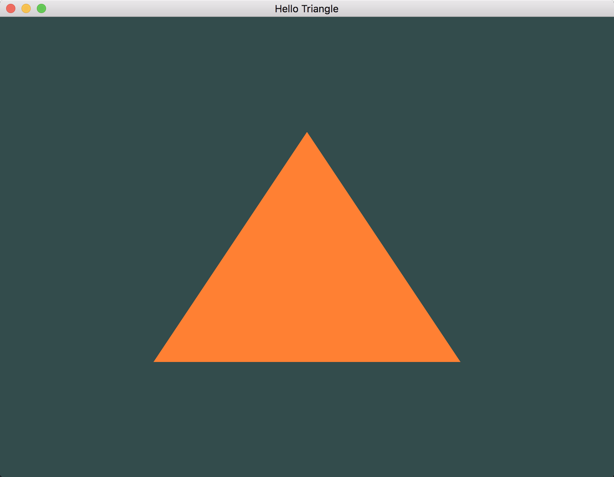

# OpenGL学习笔记（二）—— 三角形
> [上一篇](https://github.com/shenyuanluo/LearnOpenGL/tree/master/Ch01_GettingStarted/Sec01_HelloWindow) 已经把 `OpenGL` 渲染的载体准备好了，接下来的下一步就是如何网载体中渲染目标图像了。


---


## 环境说明
- Mac OS X : 10.12.6
- GLFW : 3.2.1
- GLAD : 3.3
- Xcode : 8.4


## 图形渲染管线（Graphics-Pipeline ）
我们知道，展示在屏幕上的图像都是由一个个单独的不同颜色的像素组合在一起形成的；那么，该如何确定像素以何种组合方式，以及何种颜色进行展示呢？这就需要图形渲染管线。

**图形渲染管线：**就是接受一组 `3D` 坐标，经过一系列的转换最终变成屏幕上展示的图像的处理过程。根据其不同的处理，可以细分为几个阶段：


1. **顶点着色器（Vertex Shader）：**把输入的 `3D` 坐标转为另一空间的 `3D` 坐标，这里是产生图形变换（如：移动、放大。。。）的地方。
2. **图元装配（Shape Assembly）：**将 `顶点着色器` 输出的一系列顶点作为输入并装配成指定图元的形状。
3. **几何着色器（Geometry Shader)：**把 `图元装配` 的一系列顶点的作为输入，可以通过产生新顶点构造出新的（或是其它的）图元来生成其他形状。
4. **光栅化（Rasterization）：**把图元映射为最终屏幕上相应的像素，生成供片 `段着色器` 使用的片段。
5. **片段着色器（Fragment Shader）：**计算一个像素的最终颜色，这也是所有OpenGL高级效果（比如光照、阴影、光的颜色。。。）产生的地方。
6. **测试与混合（Tests and Blending）：**检测片段的对应的深度和模板值，用它们来判断这个像素是其它物体的前面还是后面，决定是否应该丢弃；这个阶段也会检查 `alpha` 值并对物体进行混合；因此，即使在片段着色器中计算出来了一个像素输出的颜色，在渲染多个三角形的时候最后的像素颜色也可能完全不同。


在这些处理流程中，我们大多数的工作都是在 `顶点着色器` 和 `片段着色器` 中。

## NDC
在了解顶点处理之前，需要先了解 `标准化设备坐标(Normalized Device Coordinates, NDC)`。
**标准化设备坐标(Normalized Device Coordinates, NDC)：**标准化设备坐标是一个 `x`、`y` 和 `z` 值在 **-1.0** 到 **1.0** 的一小段空间；任何落在范围外的坐标都会被丢弃/裁剪，不会显示在你的屏幕上。如图：


## 顶点处理
有了顶点数据，接下来就是要告诉 `OpenGL` 该如何处理这些顶点数据：

``` C
/* 三角形顶点数据 */
GLfloat vertices[] =
{
     0.0f,  0.5f,  0.0f,            // 上 顶点
    -0.5f, -0.5f,  0.0f,            // 左下角 顶点
     0.5f, -0.5f,  0.0f,            // 右下角 顶点
};
```
顶点数据在内存类似如下：


### 顶点缓存对象（Vertex Buffer Object：VBO）
图形渲染管线是在 `GPU` 中工作的，那么位于 `CPU` 中的顶点数据怎么传递给顶点注射器呢？这就需要顶点缓存。

1. 生成唯一顶点缓存对象 ID；

	``` C
	GLuint VBO; 
	glGenBuffers(1, &VBO);
	```
2. 指定缓存对象类型；

	``` C
	glBindBuffer(GL_ARRAY_BUFFER, VBO);
	```
3. 拷贝顶点数据到缓存中；

	``` C
	glBufferData(GL_ARRAY_BUFFER, sizeof(vertices), vertices, GL_STATIC_DRAW);
	```
	- 参数1：指明顶点数据拷贝到的哪里；
	- 参数2：顶点数据大小；
	- 参数3：顶点数据；
	- 参数4：指明顶点数据的使用方式，`GL_STATIC_DRAW` 表示这些数据不会经常改变;
4. 设置顶点属性，告诉 `OpenGL` 该如何解释这些顶点数据；

	``` C
	glVertexAttribPointer(0, 3, GL_FLOAT, GL_FALSE, 3 * sizeof(GLfloat), (void*)0);
	```
	- 参数1：顶点属性位置值（跟在顶点着色器中设定的 `layout(location = 0)` 一致）；
	- 参数2：指明缓存中顶点的个数；
	- 参数3：顶点数据类型；
	- 参数4：否希望数据被标准化（NDC）；
	- 参数5：步幅，即两个顶点数据之间的间隔；
	- 参数6：顶点起始数据位置的偏移；
5. 设置好了顶点属性之后，告诉 `OpenGL` 启动这些顶点数据；

	``` C
	glEnableVertexAttribArray(0);
	```


### 顶点数组对象（Vertex Array Object：VAO）
设置好属性之后的顶点数据，为了更好的管理 `VBO`，则就需要顶点数组对象。

**顶点数组对象（Vertex Array Object：VAO）：**用于管理 `VBO`，方便 `VBO` 的使用；其内存结构如图：


1. 生成唯一顶点数组对象 ID；

	``` C
	GLuint vertexArrayObj;
	glGenVertexArrays(1, &vertexArrayObj);
	```
2. 绑定顶点数组对象，绑定之后，任何随后的顶点属性调用都会储存在其中；

	``` C
	glBindVertexArray(vertexArrayObj);
	```

### 索引缓存对象（Element Buffer Object：EBO）
**索引缓存对象（Element Buffer Object：EBO）：**用于告诉 `OpenGL` 按照何种顺序绘制顶点数据。

``` C
GLuint indices[] =
{
    0, 1, 2,
};
```

1. 生成唯一索引缓存对象 ID；

	``` C
	GLuint EBO;
	glGenBuffers(1, &EBO);
	```
2. 指定缓存对象类型；

	``` C
	glBindBuffer(GL_ELEMENT_ARRAY_BUFFER, EBO);
	```
3. 拷贝顶点数据到缓存中；

	``` C
	glBufferData(GL_ELEMENT_ARRAY_BUFFER, sizeof(indices), indices, GL_STATIC_DRAW);
	```


## 着色器
顶点数据相关属性设置好之后，则需要传递给顶点着色器进行处理。
### 顶点着色器
顶点着色器使用 `GLSL(OpenGL Shading Language)` 进行编写，如下：

``` C
#version 330 core 
layout (location = 0) in vec3 aPos; 

void main()
{
    gl_Position = vec4(aPos.x, aPos.y, aPos.z, 1.0);
}
```

- 第一行：指明了使用 `OpenGL` 的版本（3.3）以及运行模式（核心模式）；
- 第二行：指明了获取一个 `vec3` 类型的位置数据，其位置在输入数据的 **0** 偏移位置（跟设置顶点属性时一致）；
- main函数：将顶点的位置数据赋值给 `gl_Position`，`gl_Position` 是一个内置的变量，用来表示顶点位置的。

有了 `GLSL` 源码之后，则开始创建着色器：

1. 创建着色器并制定其类型；

	``` C
	GLuint shaderId;
	shaderId = glCreateShader(GL_VERTEX_SHADER);
	```
2. 将 `GLSL` 源码附加到着色器中并编译；

	``` C
	glShaderSource(shaderId, 1, &shaderCode, NULL);
	glCompileShader(shaderId);
	``` 

### 片段着色器
片段着色器使用 `GLSL(OpenGL Shading Language)` 进行编写，如下：

``` C
#version 330 core
out vec4 FragColor;

void main()
{
    FragColor = vec4(1.0f, 0.5f, 0.2f, 1.0f);
}
```

- 第一行：指明了使用 `OpenGL` 的版本（3.3）以及运行模式（核心模式）；
- 第二行：指明输出变量；
- main函数：指明片段最终输出的颜色值；

有了 `GLSL` 源码之后，则开始创建着色器：

1. 创建着色器并制定其类型；

	``` C
	GLuint shaderId;
	shaderId = glCreateShader(GL_FRAGMENT_SHADER);
	```
2. 将 `GLSL` 源码附加到着色器中并编译；

	``` C
	glShaderSource(shaderId, 1, &shaderCode, NULL);
	glCompileShader(shaderId);
	```

### 着色器程序对象
**着色器程序对象：**如果要使用刚才编译的着色器必须把它们 `链接` 为一个着色器程序对象，然后在渲染对象的时候激活这个着色器程序；已激活着色器程序的着色器将在我们发送渲染调用的时候被使用。

1. 创建着色器程序；

	``` C
	GLuint programId;
	programId = glCreateProgram()
	```
2. 添加着色器；

	``` C
	glAttachShader(programId, vShaderId);
	glAttachShader(programId, fShaderId);
	```
3. 链接着色器程序；

	``` C
	glLinkProgram(programId);
	```
	
4. 着色器程序链接成功后，着色器则可以删；

	``` C
	glDeleteShader(vShaderId);
	glDeleteShader(fShaderId);
	```
	
5. 使用着色器程序；

	``` C
	glUseProgram(programId);
	```
	

## 效果


---


# 参考资料
1. [learnopengl.com](https://learnopengl.com/Getting-started/Hello-Triangle)