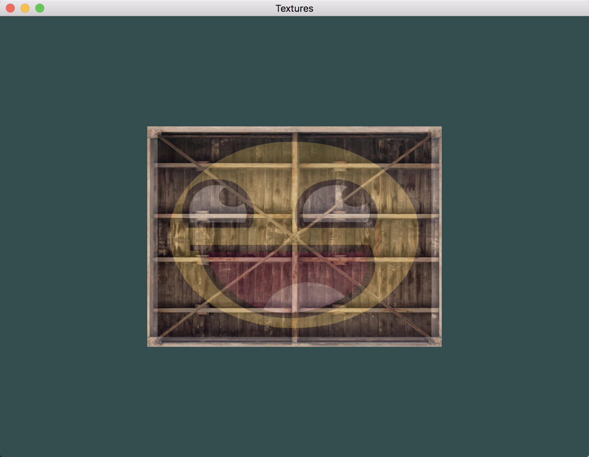

# OpenGL学习笔记（四）—— 纹理

> 为了给渲染出来的图形显示更真实的效果，这就需要 **纹理**。


---


## 环境说明
- Mac OS X : 10.12.6
- GLFW : 3.2.1
- GLAD : 3.3
- Xcode : 8.4


## 纹理
**纹理：**一张贴到物体上的二维图像。

## 映射
纹理映射规则：坐标起始于(0, 0)，也就是纹理图片的左下角，终始于(1, 1)，即纹理图片的右上角；如图：


使用纹理坐标获取纹理颜色叫做**采样(Sampling)**。


## 环绕方式
纹理坐标的范围通常是从 `(0, 0)` 到 `(1, 1)`，但是如果把纹理坐标设置在范围之外，该如何处理呢？`OpenGL` 提供了更多的选择：

| 环绕方式 | 描述 |
| :-------- | :-------- |
| `GL_REPEAT` | 重复纹理图像（默认）。 |
| `GL_MIRRORED_REPEAT ` | 	和 GL_REPEAT 一样，但每次重复图片是镜像放置的。 |
| `GL_CLAMP_TO_EDGE` | 纹理坐标会被约束在 `0` 到 `1` 之间，超出的部分会重复纹理坐标的边缘，产生一种边缘被拉伸的效果。 |
| `GL_CLAMP_TO_BORDER` | 超出的坐标为用户指定的边缘颜色。 |

效果如图：


## 过滤
由于纹理坐标可以是任意浮点值，纹理坐标不依赖于分辨率(Resolution)，所以 `OpenGL` 需要知道怎样将**纹理像素(Texture Pixel)**映射到纹理坐标，其中最常见的两种是：

- **GL_NEAREST（临近过滤）**：选择中心点最接近纹理坐标的那个像素，默认行为。

	
	
- **GL_LINEAR（线性过滤）**：纹理坐标位置附近的几个纹素值进行某种插值计算之后的结果。
	
	
	

## Mipmaps
**Mipmaps:**用于解决在场景中，距离比较远的物体的纹理真实映射问题，使看起来更真实，更有距离感。即就是一系列的纹理图片，每一张纹理图的大小都是前一张的1/4，直到剩最后一个像素为止。如图：


对于刚好在两张图片之间的物体，参考前面两种不同的过滤方式，以及 `Mipmaps` 就有了四种不同的过滤方案：

| 过滤方式 | 描述 |
| :-------- | :-------- |
| `GL_NEAREST_MIPMAP_NEAREST` | 使用最邻近的多级渐远纹理来匹配像素大小，并使用邻近插值进行纹理采样。 |
| `GL_LINEAR_MIPMAP_NEAREST` | 使用最邻近的多级渐远纹理级别，并使用线性插值进行采样。 |
| `GL_NEAREST_MIPMAP_LINEAR` | 在两个最匹配像素大小的多级渐远纹理之间进行线性插值，使用邻近插值进行采样。 |
| `GL_LINEAR_MIPMAP_LINEAR` | 在两个邻近的多级渐远纹理之间使用线性插值，并使用线性插值进行采样。 |

## 加载图片
使用 `stbi_load` 函数来加载图片，并且将图片格式信息保存起来。

``` C
GLint imgWidth;     /* 纹理图片 宽度 */
GLint imgHeight;    /* 纹理图片 高度 */
GLint nrChannel;    /* 纹理图片 颜色通道的个数 */
/* 加载纹理图片 */
GLubyte* imgData = stbi_load(imgPath, &imgWidth, &imgHeight, &nrChannel, 0);
```

## 纹理顶点
对于纹理映射，需要告诉 `OpenGL` 该如何采样纹理图片数据：

``` C
GLfloat vertices[] = 
{
    // 顶点坐标             // 颜色             // 文理坐标
     0.5f,  0.5f, 0.0f,   1.0f, 0.0f, 0.0f,   1.0f, 1.0f,   /* 右上角 顶点 */
     0.5f, -0.5f, 0.0f,   0.0f, 1.0f, 0.0f,   1.0f, 0.0f,   /* 右下角 顶点 */
    -0.5f, -0.5f, 0.0f,   0.0f, 0.0f, 1.0f,   0.0f, 0.0f,   /* 左下角 顶点 */
    -0.5f,  0.5f, 0.0f,   1.0f, 1.0f, 0.0f,   0.0f, 1.0f,   /* 左上角 顶点 */
};
```

其顶点属性在内存中如图所示：


同时更新属性：

``` C
/* 颜色属性 */
glVertexAttribPointer(1, 3, GL_FLOAT, GL_FALSE, 8 * sizeof(GLfloat), (void*)(3 * sizeof(GLfloat)));
glEnableVertexAttribArray(1);

/* 纹理属性 */
glVertexAttribPointer(2, 2, GL_FLOAT, GL_FALSE, 8 * sizeof(GLfloat), (void*)(6 * sizeof(GLfloat)));
glEnableVertexAttribArray(2);
```

顶点着色器：

``` C
#version 330 core   /* 指定GLSL版本3.3，匹配 OpenGL 版本 */

layout (location = 0) in vec3 aPos;     /* 顶点位置变量的属性位置值为：0 */
layout (location = 1) in vec3 aColor;   /* 顶点颜色变量的属性位置值为：1 */
layout (location = 2) in vec2 aTexCoor; /* 文理坐标变量的属性位置值为：2 */

out vec3 vertexColor;                   /* 输出，指定顶点颜色（传递给片段着色器） */
out vec2 texCoor;                       /* 输出，指定文理坐标（传递给片段着色器） */

void main()
{
    gl_Position = vec4(aPos.x, aPos.y, aPos.z, 1.0);
    vertexColor = aColor;       /* 从顶点数据读入的颜色数据传递给‘片段着色器’ */
    texCoor     = aTexCoor;     /* 从顶点数据读入的文理坐标数据传递给‘片段着色器’ */
}
```

片段着色器：

``` C
#version 330 core   /* 指定GLSL版本3.3，匹配 OpenGL 版本 */


in vec3 vertexColor;    /* 输入，接收顶点颜色，从顶点着色器传来的输入变量（名称相同、类型相同） */
in vec2 texCoor;        /* 输入，接收文理坐标，从顶点着色器传来的输入变量（名称相同、类型相同） */

out vec4 FragColor;     /* 输出，指定片段颜色 */

uniform sampler2D texture1; /* 纹理采样 1 */
uniform sampler2D texture2; /* 纹理采样 2 */

void main()
{
    /* 纹理组合：根据 mix 第三个参数进行线性插值计算，如果第三个值是 0.0，它会返回第一个输入；如果是 1.0，会返回第二个输入值；0.2 会返回 80% 的第一个输入颜色和 20% 的第二个输入颜色，即返回两个纹理的混合色 */
    FragColor = mix(texture(texture1, texCoor), texture(texture2, texCoor), 0.2);
}
```

## 纹理生成
1. 生成唯一纹理对象 ID；

	``` C
	GLuint textureId;
	glGenTextures(1, &textureId);
	```
2. 绑定 纹理对象，指明是 2D 纹理 

	``` C
	glBindTexture(GL_TEXTURE_2D, textureId);
	```
3. 加载纹理图片

	``` C
	GLint imgWidth;     
    GLint imgHeight;    
    GLint nrChannel; 
    GLubyte* imgData = stbi_load(imgPath, &imgWidth, &imgHeight, &nrChannel, 0);
	```
	（注意：由于**OpenGL** 期待原点`（0,0）`位于左下角，而通常一张图片的原点位于左上角，所有默认加载图片会导致上下颠倒，所有在加载图片之前调用 `stbi_set_flip_vertically_on_load(true)` 来解决此问题。）
4. 生成纹理

	``` C
	glTexImage2D(GL_TEXTURE_2D, 0, internalFormat, imgWidth, imgHeight, 0, pixelFormat, GL_UNSIGNED_BYTE, imgData);
	```
	- 参数1：指定了纹理目标；`GL_TEXTURE_2D意味着会生成与当前绑定的纹理对象在同一个目标上的纹理（任何绑定到 `GL_TEXTURE_1D` 和 `GL_TEXTURE_3D` 的纹理不会受到影响）。
	- 参数2：为纹理指定多级渐远纹理的级别。
	- 参数3：纹理保存的格式。
	- 参数4：纹理的宽度。
	- 参数5：纹理的高度。
	- 参数6：设为 **0** （历史遗留的问题）。
	- 参数7：原图片的格式。
	- 参数8：原图片的数据类型。
	- 参数9：图形数据。


## 效果



---


# 参考资料
1. [learnopengl.com](https://learnopengl.com/Getting-started/Textures)