# OpenGL学习笔记（七）—— 变换

---

# 向量
[**向量(Vector)**：](https://zh.wikipedia.org/wiki/%E5%90%91%E9%87%8F)是指一个同时具有大小(Magnitude)和方向(Direction)，且满足平行四边形法则的几何对象。在数学上通常是在字母上面加一横表示向量，如：
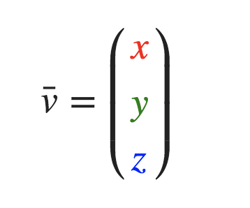

## 长度

通常通过**勾股定理**就计算：

## 单位向量
**单位向量(Unit Vector)：**长度是 `1` 的向量；其计算是通过向量的每个分量除以向量的长度得到：
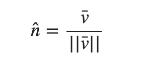

## 向量与标量运算
把一个向量`加`、`减`、`乘`、`除`一个标量(一个数字或者说是仅有一个分量的向量)，其结果是把向量的每个分量分别进行该运算。例如加法运算：
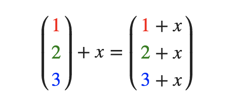

## 向量取反
对一个向量进行取反(Negate)操作会将其方向逆转；是在一个向量的每个分量前加负号予以实现取反（或者说用-1数乘该向量）：
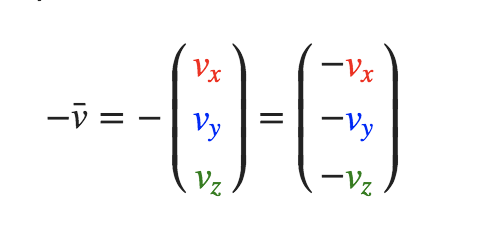

## 向量加减
向量的 `加`、`减`是两个向量的每个分量(Component-wise)对应相加、减；

- 加法：
	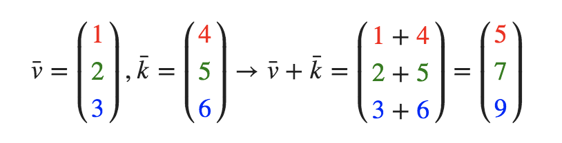
- 减法（等于加上第二个向量的相反向量）：
	
	
其方向表示：

- 加法：
	
- 减法：
	

## 向量相乘
### 点乘(Dot Product)
两个向量的点乘等于它们的数乘结果乘以两个向量之间夹角的余弦值（通过将对应分量逐个相乘，然后再把所得积相加来计算的）：

### 叉乘(Cross Product)
**叉乘只在3D空间中有定义**，需要两个互不平行向量作为输入，生成一个正交于两个输入向量的第三个向量。
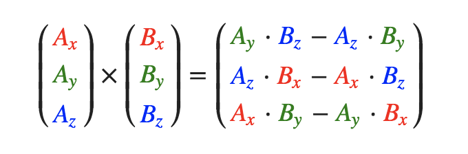

# 矩阵

## 单位矩阵
**单位矩阵(Identity Matrix)：**是一个除了对角线以外都是 `0` 的 `N×N` 矩阵。

**记住：**在 `4x4` 的矩阵中：

- 对角线上的前三元素用于 **缩放**；
- 第四列上面三个元素用于 **位移**。

## 矩阵与标量运算
把一个矩阵`加`、`减`、`乘`一个标量(一个数字或者说是仅有一个分量的向量)，其结果是矩阵的每一个元素与标量分别进行该运算。

- 加法：
	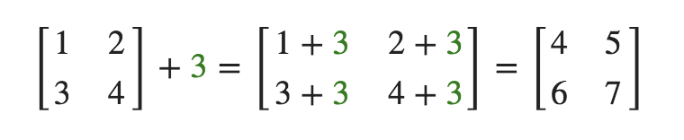
- 减法：
	
- 乘法：
	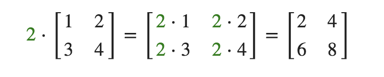

## 缩放(Scaling)
对一个向量进行缩放就是对向量的 `长度` 进行缩放，而保持它的 **方向不变**。如果把缩放变量表示为 `(S1,S2,S3)`，为任意向量 `(x,y,z)` 定义一个 **缩放矩阵**：
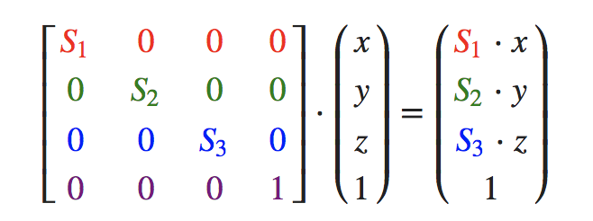

## 旋转(Rotation) 
### 角度转化
- **弧度转角度：**`角度 = 弧度 * (180.0f / PI)`
- **角度转弧度：**`弧度 = 角度 * (PI / 180.0f)`

### 旋转矩阵
旋转矩阵在 `3D` 空间中每个单位轴都有不同定义，旋转角度用 `θ` 表示：

- 沿 `x` 轴旋转：
	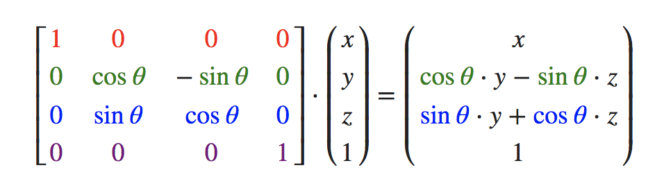
- 沿 `y` 轴旋转：
	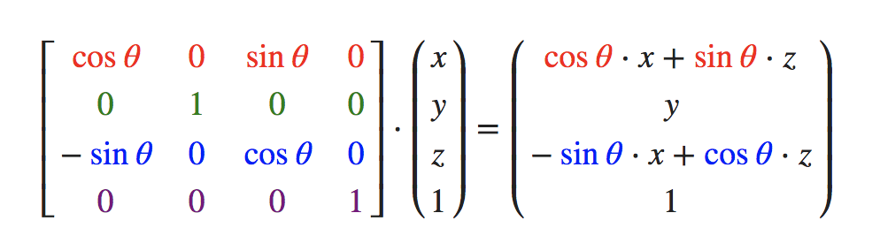
- 沿 `z` 轴旋转：
	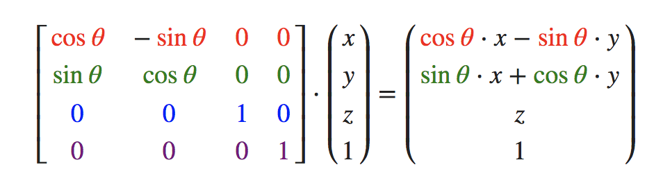
	
利用旋转矩阵可以把位置向量沿一个单位轴进行旋转，也可以把多个旋转矩阵结合起来，但是会导致 **万向节死锁(Gimbal Lock)**，可以通过视频([YouTube](https://www.youtube.com/watch?v=zc8b2Jo7mno) / [优酷](http://v.youku.com/v_show/id_XNzkyOTIyMTI=.html)）了解一下。

## 位移(Translation)
对一个向量进行位移就是在原始向量的基础上加上另一个向量从而获得一个在不同位置的新向量的过程，从而在位移向量基础上移动了原始向量。如果把位移变量表示为 `(Tx,Ty,Tz)`，为任意向量 `(x,y,z)` 定义一个 **位移矩阵**：
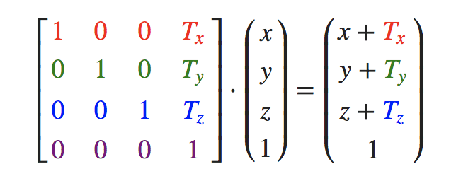

## 齐次坐标(Homogeneous Coordinates)
向量的 `w分量` 叫齐次坐标。通过把 **齐次向量** 的 `x`、`y`、`z` 坐标分别处以 `w` 坐标得到 **3D 向量**。（注意：如果一个向量的齐次坐标是 `0`，这个坐标就是**方向向量(Direction Vector)**，因为 `w` 坐标 是 `0`，这个向量就不能位移）

## 矩阵的组合
使用矩阵进行变换的真正力量在于，根据矩阵之间的乘法，可以把多个变换组合到一个矩阵中。

**注意：**矩阵乘法是不遵守交换律的，这意味着它们的顺序很重要。当矩阵相乘时，在最右边的矩阵是第一个与向量相乘的，所以应该从右向左读矩阵乘法。

**建议：**在组合矩阵时，先进行 `缩放操作`，然后是 `旋转`，最后才是 `位移`，否则它们会互相影响。

# 效果

---

# 参考资料
1. [learnopengl.com](https://learnopengl.com/Getting-started/Transformations)