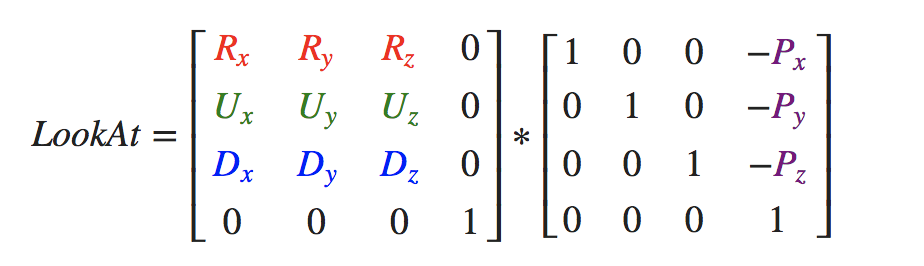
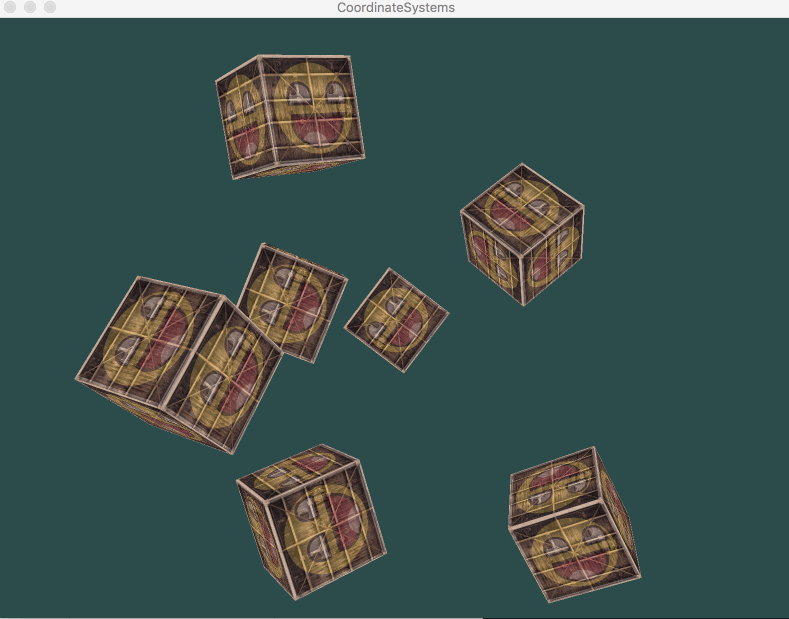

# OpenGL学习笔记（九）—— 摄像机

---

`OpenGL` 本身没有 **摄像机(Camera)** 的概念，但通过把场景中的所有物体往相反方向移动的方式来模拟出摄像机，产生一种观察者在移动的感觉，而不是场景在移动。

要定义一个摄像机，通常需要它在世界空间中的位置、观察的方向、一个指向它右测的向量以及一个指向它上方的向量


## Look At 矩阵
**Look At 矩阵：**使用 `3个` **相互垂直（或非线性）** 的轴定义了一个坐标空间，使用这 3 个轴外加一个平移向量来创建一个矩阵，则可以用这个矩阵乘以任何向量来将其变换到所定义的坐标空间。



其中 `R` 是右向量，`U` 是上向量，`D` 是方向向量 `P` 是摄像机位置向量。(注意，位置向量是相反的，因为希望把世界平移到与观察者自身移动的相反方向。)

## 欧拉角
**欧拉角(Euler Angle)**是可以表示 `3D` 空间中任何旋转的 3 个值，有：`俯仰角(Pitch)`、`偏航角(Yaw)` 和 `滚转角(Roll)`，如图：


- 俯仰角：是描述往上或往下看的角。
- 偏航角：是描述往左和往右看的角。
- 滚转角：是描述摄像机翻滚的角。（通常在太空飞船的摄像机中使用）


由图可得摄像机的前轴计算：

``` C
direction.x = cos(glm::radians(pitch)) * cos(glm::radians(yaw)); 
direction.y = sin(glm::radians(pitch));
direction.z = cos(glm::radians(pitch)) * sin(glm::radians(yaw));
```

# 效果


---

# 参考资料
1. [learnopengl.com](https://learnopengl.com/Getting-started/Camera)