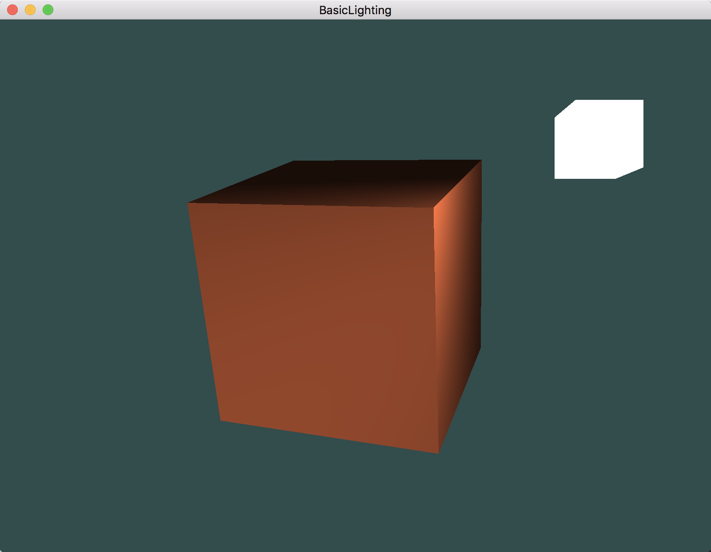
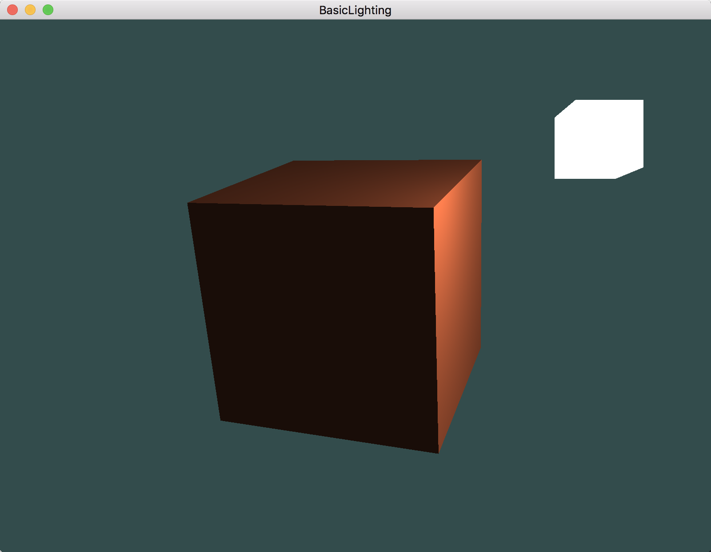

# OpenGL学习笔记（十二）—— 基础光照

---


## 冯氏光照模型（Phong Lighting Model）
冯氏光照模型的主要结构由 3 个分量组成：`环境(Ambient)`、`漫反射(Diffuse)` 和 `镜面(Specular)`光照。


1. **环境光照(Ambient Lighting)：**即使在黑暗的情况下，世界上通常也仍然有一些光亮（月亮、远处的光），因此物体几乎永远不会是完全黑暗的。为了模拟这个，使用一个 `环境光照常量`，永远会给物体一些颜色。
2. **漫反射光照(Diffuse Lighting)：**模拟光源对物体的方向性影响(Directional Impact)；是冯氏光照模型中视觉上最显著的分量。物体的某一部分越是正对着光源，它就会越亮。
3. **镜面光照(Specular Lighting)：**模拟有光泽物体上面出现的亮点。镜面光照的颜色相比于物体的颜色会更倾向于光的颜色。


## 环境光照
一个简化的全局照明模型，使用一个很小的**常量**（光照）颜色，添加到物体片段的最终颜色中，这样子的话即便场景中没有直接的光源也能看起来存在有一些发散的光。环境光照添加到场景：

``` C
/* fragmeng shader */

#version 330 core

out vec4 FragColor;		/* 输出，指定片段颜色 */

uniform vec3 objectColor;   /* 物体颜色 */
uniform vec3 lightColor;    /* 光照颜色 */

void main()
{
	/* ========== '环境光照'处理 ========== */
    float ambientStrength = 0.1;		/* 环境因子（强度） */
    vec3 ambient = ambientStrength * lightColor;	/* 环境光分量 = 环境因子 * 光照  */

    vec3 result = ambient * objectColor;	/* 最终光照 = 环境光分量 * 物体颜色  */
    FragColor   = vec4(result, 1.0);		/* 片段颜色输出 */ 
}
```

## 漫反射光照
**漫反射光照** 使物体上与光线方向越接近的片段能从光源处获得更多的亮度，即光线与`片段法向量`之间的夹角越小，该片段最终显示的颜色就越亮，反之，越暗。如图：


所以，计算漫反射光照需要:

1. **法向量：**一个垂直于顶点表面的（单位）向量。
2. **定向的光线：**`光源的位置向量` 与 `片段的位置向量` 的 **向量差** 的方向向量。

``` C
/* fragmeng shader */

#version 330 core

in vec3 FragPos;        /* 顶点位置向量 */
in vec3 Normal;         /* 顶点法向量 */

out vec4 FragColor;		/* 输出，指定片段颜色 */

uniform vec3 objectColor;   /* 物体颜色 */
uniform vec3 lightColor;    /* 光照颜色 */

uniform vec3 lightPos;      /* 光源位置向量 */
uniform vec3 viewerPos;     /* 观察者位置向量 */

void main()
{
	/* ========== '环境光照'处理 ========== */
    float ambientStrength = 0.1;		/* 环境因子（强度） */
    vec3 ambient = ambientStrength * lightColor;	/* 环境光分量 = 环境因子 * 光照  */
    
    
    /* ========== '漫反射光照'处理 ========== */
    vec3 norm = normalize(Normal);  /* 将法向量标准化（单位向量）*/
    vec3 lightDir = normalize(lightPos - FragPos);  /* 光源方向向量 = 光源位置向量 - 片段位置向量 (将光源方向向量标准化（单位向量）)*/
    float diffuseEffect = max(dot(norm, lightDir), 0.0f);	/* 漫反射（对光照的）影响 = 单位法向量 · 单位光照方向向量 */
    vec3 diffuseLight = diffuseEffect * lightColor;	/* 漫反射分量 = 漫反射影响 * 光照 */


    vec3 result = (ambient + diffuseLight) * objectColor;	/* 最终光照 = （环境光分量 + 漫反射分量） * 物体颜色  */
    FragColor   = vec4(result, 1.0);		/* 片段颜色输出 */ 
}
```


## 镜面光照


### 法线矩阵
**法线矩阵：**定义为模型矩阵左上角的逆矩阵的转置矩阵。


## 效果
1. 环境光照


2. 漫反射光照


3. 镜面光照



---


# 参考
教程来源：[https://learnopengl.com/](https://learnopengl.com/Lighting/Basic-Lighting)。