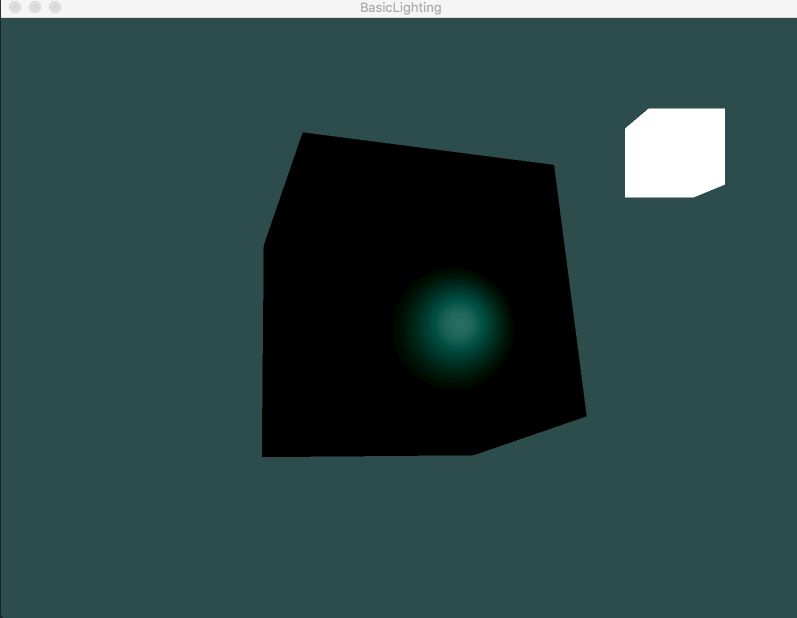

# OpenGL学习笔记（十三）—— 材质

---


现实世界的物体，对光产生不同的反应；针对镜面高光，也有不同的反应；物体在反射光的时候，如果散射的光比较少，则会产生较小的高光点，如果散射的光比较多，则会产生较大的高光点。

## 材质属性
当描述一个物体的时候，一般是通过一个 **材质颜色(Material Color)** 和 **反光度(Shininess)** 来控制材质的属性；其中材质颜色包括：`环境光照(Ambient Lighting)`、`漫反射光照(Diffuse Lighting)` 和 `镜面光照(Specular Lighting)`。如下结构体：

``` C
/* 材质属性 */
struct Material {
    vec3 ambient;       /* 环境光照 */
    vec3 diffuse;       /* 漫反射光照 */
    vec3 specular;      /* 镜面光照 */
    float shininess;    /* 反光度 */
};
```

- **ambient：**在环境光照下这个物体反射得是什么颜色（通常这和 `物体颜色` 是相同的）。
- **diffuse：**在漫反射光照下物体的颜色（同样：漫反射颜色也要设置为需要的物体颜色）。
- **specular：**镜面光照对物体的颜色影响（或者甚至可能反射一个物体特定的镜面高光颜色）。
- **shininess：**影响镜面高光的散射/半径。

## 光照属性
光源对 `环境光`、`漫反射` 和 `镜面光` 分量也具有着不同的 **强度**。

``` C
/* 光照属性 */
struct Light {
    vec3 position;      /* 光源位置 */
    vec3 ambient;       /* 环境光照·强度 */
    vec3 diffuse;       /* 漫反射光照·强度 */
    vec3 specular;      /* 镜面光照·强度 */
};
```

- 环境光照：通常设置为一个比较低的强度（这样环境光颜色不会太过显眼）。
- 漫反射光照：通常设置为光所具有的颜色（通常是一个比较明亮的白色）。
- 镜面光照：通常会保持为 `vec3(1.0)`（以最大强度发光）。


## 材质属性表

<table>
	<tr>
		<td> Name </td>
		<th colspan = "3"> Ambient </th>
		<th colspan = "3"> Diffuse </th>
		<th colspan = "3"> Specular </th>
		<th> Shininess </th>
	</tr>
	
	<tr>
		<th> emerald </th>
		<td> 0.0215 </td>
		<td> 0.1745 </td>
		<td> 0.0215 </td> 
		<td> 0.07568 </td> 
		<td> 0.61424 </td> 
		<td> 0.07568 </td>
		<td> 0.633 </td> 
		<td> 0.727811 </td> 
		<td> 0.633 </td> 
		<td> 0.6 </td>
	</tr>
	
	<tr>
		<th> jade </th>
		<td> 0.135 </td>
		<td> 0.2225 </td>
		<td> 0.1575 </td>
		<td> 0.54 </td>
		<td> 0.89 </td>
		<td> 0.63 </td>
		<td> 0.316228 </td>
		<td> 0.316228 </td>
		<td> 0.316228 </td>
		<td> 0.1 </td>
	</tr>
		
	<tr>	
		<th> obsidian </th>
		<td> 0.05375 </td>
		<td> 0.05 </td>
		<td> 0.06625 </td>
		<td> 0.18275 </td>
		<td> 0.17 </td>
		<td> 0.22525 </td>
		<td> 0.332741 </td>
		<td> 0.328634 </td>
		<td> 0.346435 </td>
		<td> 0.3 </td>
	</tr>
		
	<tr>
		<th> pearl </th>
		<td> 0.25 </td>
		<td> 0.20725 </td>
		<td> 0.20725 </td>
		<td> 1 </td>
		<td> 0.829 </td>
		<td> 0.829 </td>
		<td> 0.296648 </td>
		<td> 0.296648 </td>
		<td> 0.296648 </td>
		<td> 0.088 </td>
	</tr>
		
	<tr>
		<th> ruby </th>
		<td> 0.1745 </td>
		<td> 0.01175 </td>
		<td> 0.01175 </td>
		<td> 0.61424 </td>
		<td> 0.04136 </td>
		<td> 0.04136 </td>
		<td> 0.727811 </td>
		<td> 0.626959 </td>
		<td> 0.626959 </td>
		<td> 0.6 </td>
	</tr>
		
	<tr>
		<th> turquoise </th>
		<td> 0.1 </td>
		<td> 0.18725 </td>
		<td> 0.1745 </td>
		<td> 0.396 </td>
		<td> 0.74151 </td>
		<td> 0.69102 </td>
		<td> 0.297254 </td>
		<td> 0.30829 </td>
		<td> 0.306678 </td>
		<td> 0.1 </td>
	</tr>
		
	<tr>
		<th> brass </th>
		<td> 0.329412 </td>
		<td> 0.223529 </td>
		<td> 0.027451 </td>
		<td> 0.780392 </td>
		<td> 0.568627 </td>
		<td> 0.113725 </td>
		<td> 0.992157 </td>
		<td> 0.941176 </td>
		<td> 0.807843 </td>
		<td> 0.21794872 </td>
	</tr>
		
	<tr>
		<th> bronze </th>
		<td> 0.2125 </td>
		<td> 0.1275 </td>
		<td> 0.054 </td>
		<td> 0.714 </td>
		<td> 0.4284 </td>
		<td> 0.18144 </td>
		<td> 0.393548 </td>
		<td> 0.271906 </td>
		<td> 0.166721 </td>
		<td> 0.2 </td><td>
	</tr>
		
	<tr>
		<th> chrome </th>
		<td> 0.25 </td>
		<td> 0.25 </td>
		<td> 0.25 </td>
		<td> 0.4 </td>
		<td> 0.4 </td>
		<td> 0.4 </td>
		<td> 0.774597 </td>
		<td> 0.774597 </td>
		<td> 0.774597 </td>
		<td> 0.6 </td>
	</tr>
		
	<tr>
		<th> copper </th>
		<td> 0.19125 </td>
		<td> 0.0735 </td>
		<td> 0.0225 </td>
		<td> 0.7038 </td>
		<td> 0.27048 </td>
		<td> 0.0828 </td>
		<td> 0.256777 </td>
		<td> 0.137622 </td>
		<td> 0.086014 </td>
		<td> 0.1 </td>
	</tr>
		
	<tr>
		<th>  gold </th>
		<td> 0.24725 </td>
		<td> 0.1995 </td>
		<td> 0.0745 </td>
		<td> 0.75164 </td>
		<td> 0.60648 </td>
		<td> 0.22648 </td>
		<td> 0.628281 </td>
		<td> 0.555802 </td>
		<td> 0.366065 </td>
		<td> 0.4 </td>
	</tr>
		
	<tr>
		<th> silver </th>
		<td> 0.19225 </td>
		<td> 0.19225 </td>
		<td> 0.19225 </td>
		<td> 0.50754 </td>
		<td> 0.50754 </td>
		<td> 0.50754 </td>
		<td> 0.508273 </td>
		<td> 0.508273 </td>
		<td> 0.508273 </td>
		<td> 0.4 </td>
	</tr>
		
	<tr>
		<th> black plastic </th>
		<td> 0.0 </td>
		<td> 0.0 </td>
		<td> 0.0 </td>
		<td> 0.01 </td>
		<td> 0.01 </td>
		<td> 0.01 </td>
		<td> 0.50 </td>
		<td> 0.50 </td>
		<td> 0.50 </td>
		<td> 0.25 </td>
	</tr>
		
	<tr>
		<th> cyan plastic </th>
		<td> 0.0 </td>
		<td> 0.1 </td>
		<td> 0.06 </td>
		<td> 0.0 </td>
		<td> 0.50980392 </td>
		<td> 0.50980392 </td>
		<td> 0.50196078 </td>
		<td> 0.50196078 </td>
		<td> 0.50196078 </td>
		<td> 0.25 </td>
	</tr>
		
	<tr>
		<th> green plastic </th>
		<td> 0.0 </td>
		<td> 0.0 </td>
		<td> 0.0 </td>
		<td> 0.1 </td>
		<td> 0.35 </td>
		<td> 0.1 </td>
		<td> 0.45 </td>
		<td> 0.55 </td>
		<td> 0.45 </td>
		<td> 0.25 </td>
	</tr>
		
	<tr>
		<th> red plastic </th>
		<td> 0.0 </td>
		<td> 0.0 </td>
		<td> 0.0 </td>
		<td> 0.5 </td>
		<td> 0.0 </td>
		<td> 0.0 </td>
		<td> 0.7 </td>
		<td> 0.6 </td>
		<td> 0.6 </td>
		<td> 0.25 </td>
	</tr>
		
	<tr>
		<th> white plastic </th>
		<td> 0.0 </td>
		<td> 0.0 </td>
		<td> 0.0 </td>
		<td> 0.55 </td>
		<td> 0.55 </td>
		<td> 0.55 </td>
		<td> 0.70 </td>
		<td> 0.70 </td>
		<td> 0.70 </td>
		<td> 0.25 </td>
	</tr>
		
	<tr>
		<th> yellow plastic </th>
		<td> 0.0 </td>
		<td> 0.0 </td>
		<td> 0.0 </td>
		<td> 0.5 </td>
		<td> 0.5 </td>
		<td> 0.0 </td>
		<td> 0.60 </td>
		<td> 0.60 </td>
		<td> 0.50 </td>
		<td> 0.25 </td>
	</tr>
		
	<tr>
		<th> black rubber </th>
		<td> 0.02 </td>
		<td> 0.02 </td>
		<td> 0.02 </td>
		<td> 0.01 </td>
		<td> 0.01 </td>
		<td> 0.01 </td>
		<td> 0.4 </td>
		<td> 0.4 </td>
		<td> 0.4 </td>
		<td> 0.078125 </td>
	</tr>
		
	<tr>
		<th> cyan rubber </th>
		<td> 0.0 </td>
		<td> 0.05 </td>
		<td> 0.05 </td>
		<td> 0.4 </td>
		<td> 0.5 </td>
		<td> 0.5 </td>
		<td> 0.04 </td>
		<td> 0.7 </td>
		<td> 0.7 </td>
		<td> 0.078125 </td>
	</tr>
		
	<tr>
		<th> green rubber </th>
		<td> 0.0 </td>
		<td> 0.05 </td>
		<td> 0.0 </td>
		<td> 0.4 </td>
		<td> 0.5 </td>
		<td> 0.4 </td>
		<td> 0.04 </td>
		<td> 0.7 </td>
		<td> 0.04 </td>
		<td>0.078125 </td>
	</tr>
		
	<tr>
		<th> red rubber </th>
		<td> 0.05 </td>
		<td> 0.0 </td>
		<td> 0.0 </td>
		<td> 0.5 </td>
		<td> 0.4 </td>
		<td> 0.4 </td>
		<td> 0.7 </td>
		<td> 0.04 </td>
		<td> 0.04 </td>
		<td>0.078125 </td>
	</tr>
		
	<tr>
		<th> white rubber </th>
		<td> 0.05 </td>
		<td> 0.05 </td>
		<td> 0.05 </td>
		<td> 0.5 </td>
		<td> 0.5 </td>
		<td> 0.5 </td>
		<td> 0.7 </td>
		<td> 0.7 </td>
		<td> 0.7 </td>
		<td>0.078125 </td>
	</tr>
		
	<tr>
		<th> yellow rubber </th>
		<td> 0.05 </td>
		<td> 0.05 </td>
		<td> 0.0 </td>
		<td> 0.5 </td>
		<td> 0.5 </td>
		<td> 0.4 </td>
		<td> 0.7 </td>
		<td> 0.7 </td>
		<td> 0.04 </td>
		<td>0.078125 </td>
	</tr>
</table>


# 效果



---


# 参考
教程来源：[https://learnopengl.com/](https://learnopengl.com/Lighting/Materials)。