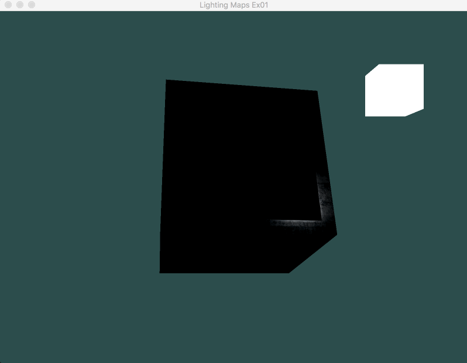
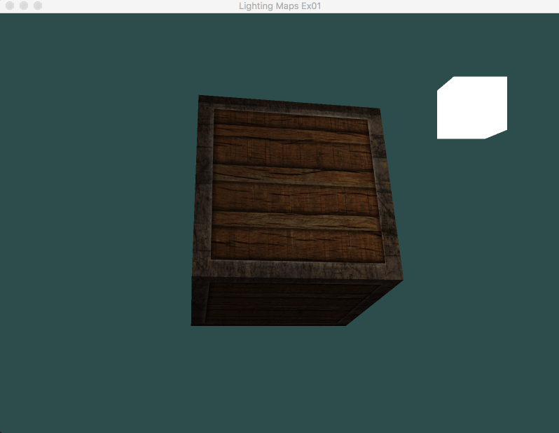

# Lighting maps Exercises 1
> 调整光源的环境光、漫反射和镜面光向量，看看它们如何影响箱子的视觉输出。

1. 使用 `sin` 函数改变 环境光：

2. 使用 `sin` 函数改变 漫反射：

1. 使用 `sin` 函数改变 镜面光：

---

# 参考
教程来源：[https://learnopengl.com/](https://learnopengl.com/Lighting/Lighting-maps)。