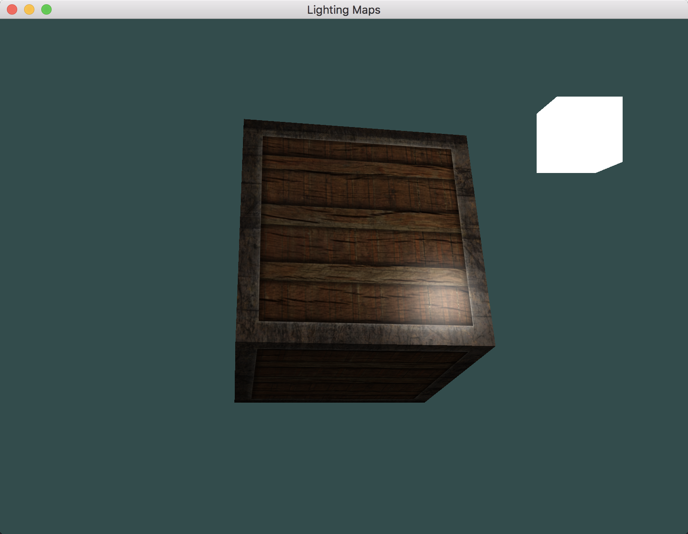
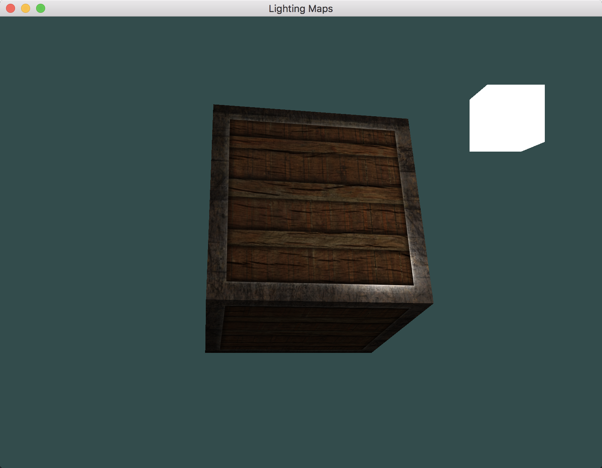

# OpenGL学习笔记（十四）—— 光照贴图

---

## 漫反射贴图
**漫反射贴图(Diffuse Map)：**在光照场景中，使用一张覆盖物体的图像，使其能够逐片段索引其独立的颜色值来代表一个物体的漫反射颜色的纹理图。

## 镜面光贴图
**镜面光贴图(Specular Map)：**镜面高光的强度可以通过图像每个像素的亮度来获取，让物体的某些部分以不同的强度显示镜面高光。

使用 `Photoshop` 或 `Gimp` 之类的工具，将 *漫反射纹理* 转换为 *镜面光纹理* 还是比较容易的，只需要剪切掉一些部分，将图像转换为黑白的，并增加亮度/对比度就好了。

## 放射光贴图
- **放射光贴图(Emission Map)：**是一个储存了每个片段的 `发光值(Emission Value)` 的贴图。
- **发光值(Emission Value)：**是一个包含（假设）光源的物体 `发光(Emit)` 时可能显现的颜色，这样物体就能够忽略光照条件进行 `发光(Glow)`。

例如，游戏中某个物体在发光的时候，你通常看到的就是放射光贴图（比如 机器人的眼，或是箱子上的灯带）。

# 效果
漫反射贴图

镜面贴图

---

# 参考
教程来源：[https://learnopengl.com/](https://learnopengl.com/Lighting/Lighting-maps)。