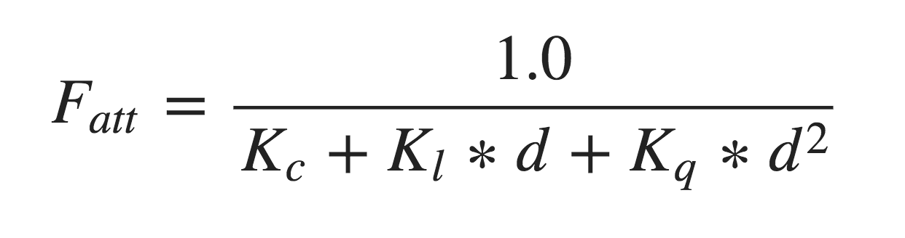
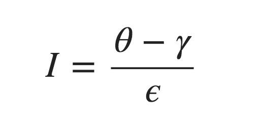

# OpenGL学习笔记（十五）—— 投光物

---

## 投光物
**投光物(Light Caster)：**将光 `投射(Cast)`到物体的光源。

## 定向光
**定向光(Directional Light)：**一个处于无限远的光源（也叫做平行光），看似所有光线都朝着某一方向传播。

当一个光源处于很远的地方时，来自光源的每条光线就会近似于互相平行；不论物体和/或者观察者的位置，看起来好像所有的光都来自于同一个方向。（例如：太阳。）


通过定义一个光线 `方向向量` 而不是位置向量来模拟一个定向光。

### 定向光的判定
- **位置向量** 定义为一个 `vec4` 时，必需将 *w* 分量设置为 `1.0`，这样 *变换* 和 *投影* 才能正确应用。
- **方向向量** 定义为一个 `vec4` 时，必需将 *w* 分量设置为 `0.0`，这样 *位移* 时就不会有任何的效果（因为它仅仅代表的是方向）。

这样就可以通过检测 *w分量* 是否等于 `1.0` 来判断是光的 **位置向量** 还是光的 **方向向量** 了：（这正是旧 OpenGL（固定函数式）决定光源是定向光还是位置光源(Positional Light Source)的方法，并根据它来调整光照。）

``` C
if(0.0 == lightVector.w) // 注意浮点数据类型的误差
{
  // 执行定向光照计算
}
else if(lightVector.w == 1.0)
{
  // 根据光源的位置做光照计算
}
```

## 点光源
**点光源(Point Light)：**是一个朝着所有方向照射光线，但光线会随着距离逐渐衰减的光源；其能够配置位置和衰减（例如：灯泡）。


## 衰减
**衰减(Attenuation)：**随着光线传播距离的增长而光的强度逐渐削减的过程。

在现实世界中，灯在近处通常会非常亮，但随着距离的增加光源的亮度一开始会下降非常快，但在远处时剩余的光强度就会下降的非常缓慢了。根据现实现象，得出如下计算公式：


其中：

- **d：**表示片段距光源的距离；
- **Kc：**常数项，常数项通常保持为 `1.0`，这样就保证分母永远不会比 1 小，不然在某些距离上光强度反而会增加。
- **Kl：**一次项，与距离相乘，以线性的方式减少强度。
- **Kq：**二次项，与距离的平方相乘，让光源以二次递减的方式减少强度。（这样在距离比较小的时候衰减较小，当距离较大时衰减较大，比较符合现实现象。）

如下显示了在 `100` 的距离内衰减的效果：


### 衰减公式数值选择

如下表格（来源于：[Ogre Wiki](http://wiki.ogre3d.org/tiki-index.php?page=-Point+Light+Attenuation)）显示了模拟一个（大概）真实的，覆盖特定半径（距离）的光源时，这些项可能取的一些值：

| (光照覆盖)距离：`d` | 常数项：`Kc` | 一次项：`Kl` | 二次项：`Kq` |
| -------- | -------- | -------- | -------- |
| 3250 | 1.0 | 0.0014 | 0.000007 |
| 600 | 1.0 | 0.007 | 0.0002 |
| 325 | 1.0 | 0.014 | 0.0007 |
| 200 | 1.0 | 0.022 | 0.0019 |
| 160 | 1.0 | 0.027 | 0.0028 |
| 100 | 1.0 | 0.045 | 0.0075 |
| 65 | 1.0 | 0.07 | 0.017 |
| 50 | 1.0 | 0.09 | 0.032 |
| 32 | 1.0 | 0.14 | 0.07 |
| 20 | 1.0 | 0.22 | 0.20 |
| 13 | 1.0 | 0.35 | 0.44 |
| 7 | 1.0 | 0.7 | 1.8 |


## 聚光
**聚光(Spotlight)：**是一个只朝某个特定方向(而不是所有方向)照射光线的光源；只有在聚光方向的特定半径内的物体才会被照亮，其它的物体都会保持黑暗（例如：手电筒、路灯）。

`OpenGL` 中聚光是用一个**世界空间位置**、一个**方向**和一个**切光角(Cutoff Angle)**来表示的，切光角指定了聚光的半径（是圆锥的半径不是距光源距离那个半径）。如图：


- **LightDir：**从片段指向光源的向量。
- **SpotDir：**聚光所指向的方向向量。
- **ϕ（Phi）：**指定了聚光半径的切光角，即圆锥`半顶角`(落在这个角度之外的物体都不会被这个聚光所照亮)。
- **θ（Theta）：**`LightDir` 向量和 `SpotDir` 向量之间的夹角。在聚光内部的话 `θ` 值应该比 `ϕ` 值小。

> 注意：在聚光计算中，通常通过计算 `ϕ` 和 `θ` 的余弦值进行比较。

### 手电筒
**手电筒(Flashlight)：**是一个位于观察者位置的聚光，通常它都会瞄准观察者视角的正前方（基本上说，手电筒就是普通的聚光，但它的位置和方向会随着观察者的位置和朝向不断更新。）。


### 平滑/软化边缘
对于聚光的硬边圈，需要模拟聚光有一个 `内圆锥(Inner Cone)` 和一个 `外圆锥(Outer Cone)`；内圆锥就是聚光显示的范围，外圆锥是用于控制聚光(强度)从内圆锥到外援追逐渐变暗的过程。

对于**外圆锥**，需要定义一个`聚光方向向量` 和 `外圆锥向量` 的夹角的 `余弦值` ；如果片段处于内外圆锥之间，将计算出一个 `0.0` 到 `1.0` 之间的强度值，如果片段在内圆锥之内，强度就是 `1.0`，如果片段在外圆锥之外强度值就是 `0.0`。

由此，内圆锥到外援追之间的强度计算公式如下：


其中：

- **θ（Theta）：**`LightDir` 向量和 `SpotDir` 向量之间的夹角的 **余弦值**。
- **ϕ（Phi）：**内圆锥半顶角（内切光角）的 **余弦值**。
- **γ（Gamma）：**外圆锥半顶角（外切光角）的 **余弦值**。
- **ϵ（Epsilon）：**是 `内圆锥（ϕ）`和 `外圆锥（γ）`之间的 `余弦值差（ϵ = ϕ − γ）`。
- **I：**当前片段聚光的强度。

例如：（来自[这里](https://learnopengl.com/Lighting/Light-casters)）

| `θ`(余弦) | `θ`(夹角)| `ϕ`(余弦) | `ϕ`(内光切角) | `γ`(余弦) | `γ`(外光切角) | `ϵ` | `I`(聚光强度) |
| -------- | -------- | -------- | -------- | -------- | -------- | -------- | -------- | 
| 0.87 | 30 | 0.91 | 25 | 0.82 | 35 | 0.91 - 0.82 = 0.09 | 0.87 - 0.82 / 0.09 = 0.56 | 
| 0.9 | 26 | 0.91 | 25 | 0.82 | 35 | 0.91 - 0.82 = 0.09 | 0.9 - 0.82 / 0.09 = 0.89 |
| 0.97 | 14 | 0.91 | 25 | 0.82 | 35 | 0.91 - 0.82 = 0.09 | 0.97 - 0.82 / 0.09 = 1.67 |
| 0.83 | 34 | 0.91 | 25 | 0.82 | 35 | 0.91 - 0.82 = 0.09 | 0.83 - 0.82 / 0.09 = 0.11 |
| 0.64 | 50 | 0.91 | 25 | 0.82 | 35 | 0.91 - 0.82 = 0.09 | 0.64 - 0.82 / 0.09 = -2.0 |
| 0.966 | 15 | 0.9978 | 12.5 | 0.953 | 17.5 | 0.966 - 0.953 = 0.0448 | 0.966 - 0.953 / 0.0448 = 0.29 |


---


# 参考
教程来源：[https://learnopengl.com/](https://learnopengl.com/Lighting/Light-casters)。