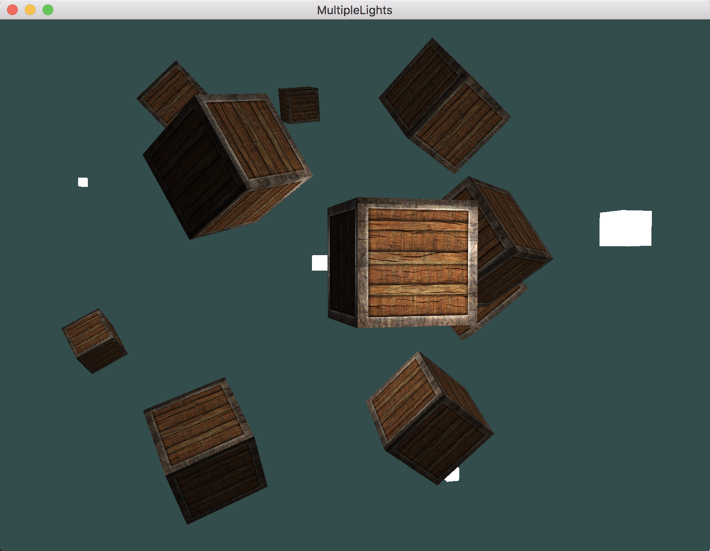

# OpenGL学习笔记（十六）—— 多光源

---

## GLSL 函数
> `GLSL` 中的函数和 `C` 函数很相似，它有一个函数名、一个返回值类型，如果函数不是在 `main` 函数之前声明的，则必须在代码文件顶部声明一个原型。

## 多光源
当在场景中使用多个光源时，由于每一个光源都会对片段产生一定的影响，所以需要一个单独的颜色向量，将每个光源对片段的影响累加，以得出最终的片段颜色。大体的结构如下：

``` C
out vec4 FragColor;        /* 片段颜色 */

void main()
{
    /* 定义一个输出颜色值 */
    vec3 output;
    
    /* 计算（并累加）定向光源对片段的影响 */
    output += someFunctionToCalculateDirectionalLight();
    
    /* 计算（并累加）所有点光源对片段的影响 */
    for(int i = 0; i < nr_of_point_lights; i++)
    {
        output += someFunctionToCalculatePointLight();
    }
    
    /* 计算（并累加）其他聚光源对片段的影响 */
    output += someFunctionToCalculateSpotLight();
    
    /* 片段最终颜色 */
    FragColor = vec4(output, 1.0);
}
```

# 效果



---


# 参考
教程来源：[https://learnopengl.com/](http://learnopengl.com/#!Lighting/Multiple-lights)。