# OpenGL学习笔记（十八）—— Assimp

---

## 3D 模型
`3D 模型` 通常是在 [Blender](https://www.blender.org/)、[3DS Max](https://www.autodesk.nl/products/3ds-max/overview) 或者 [Maya](https://www.autodesk.com/products/maya/overview) 3D建模工具(3D Modeling Tool)中制作完成；并使用 **UV映射(uv-mapping)** 的手段来应用贴图。这些工具将会在导出到模型文件的时候自动生成所有的 `顶点坐标`、`顶点法线` 以及 `纹理坐标`。

模型的文件格式有很多种，每一种都会以它们自己的方式来导出模型数据。例如：

- [Wavefront的.obj](https://en.wikipedia.org/wiki/Wavefront_.obj_file)模型文件格式：只包含了模型数据以及材质信息（如，`模型颜色` 和 `漫反射/镜面光贴图`。
- [Collada](https://en.wikipedia.org/wiki/COLLADA)模型文件格式：包含模型、光照、多种材质、动画数据、摄像机、完整的场景信息等等。


## 模型加载库
**Assimp(Open Asset Import Library)：**能够导入很多种不同的模型文件格式（并也能够导出部分的格式），并将所有的模型数据加载至 `Assimp` 的通用数据结构中。一个简化的 `Assimp` 数据结构模型如图：


- 和材质和网格(Mesh)一样，所有的场景/模型数据都包含在`Scene`对象中。`Scene`对象也包含了场景根节点的引用。
- 场景的`Root node`（根节点）可能包含子节点（和其它的节点一样），包含了一系列指向场景对象中`mMeshes`数组中储存的网格(组合模型的每个单独的形状)数据的索引。`Scene`下的`mMeshes`数组储存了**真正的Mesh对象**，节点中的`mMeshes`数组保存的只是场景中网格数组的索引。
- 一个`Mesh`对象本身包含了渲染所需要的所有相关数据，像是**顶点位置**、**法向量**、**纹理坐标**、**面(Face)**和物体的**材质**。
- 一个网格包含了多个Face（Face代表的是物体的渲染图元(Primitive)（三角形、方形、点））。一个面包含了组成图元的顶点的索引
- 一个网格也包含了一个Material对象，它包含了一些函数能让我们获取物体的材质属性，比如说**颜色**和**纹理贴图**（比如漫反射和镜面光贴图）。

一个网格是在OpenGL中绘制物体所需的最小单位（顶点数据、索引和材质属性）；一个模型（通常）会包括多个网格。


## 构建Assimp
前提：已安装 Xcode 和 CMake 工具。

1. 下载 [Assimp](https://github.com/assimp/assimp)，并解压。

	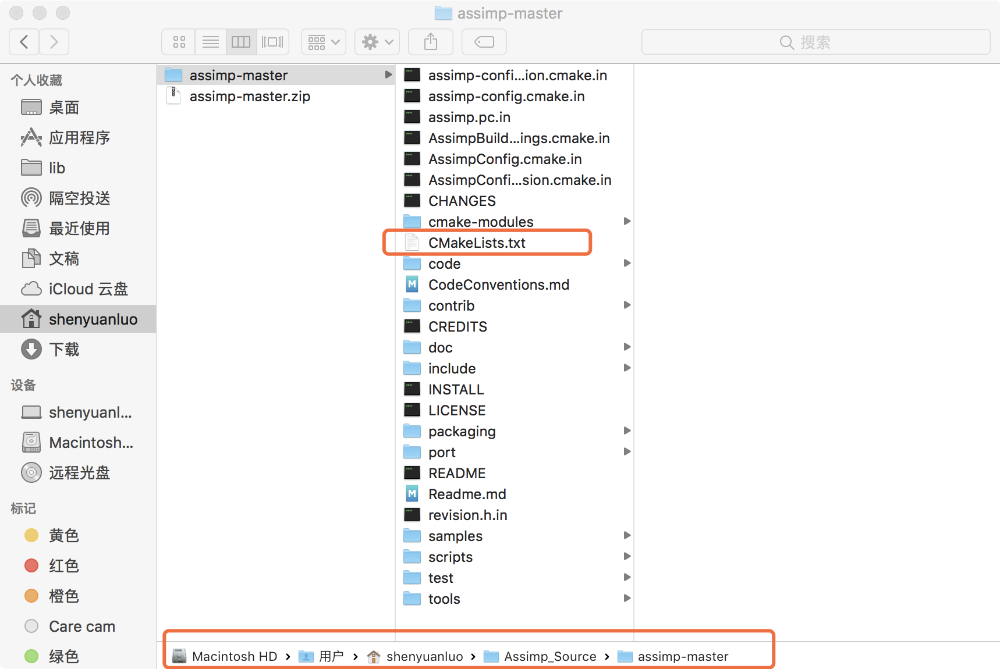
2. 打开 **CMake gui**，选择 `源代码目录` 和 `目标文件目录`。

	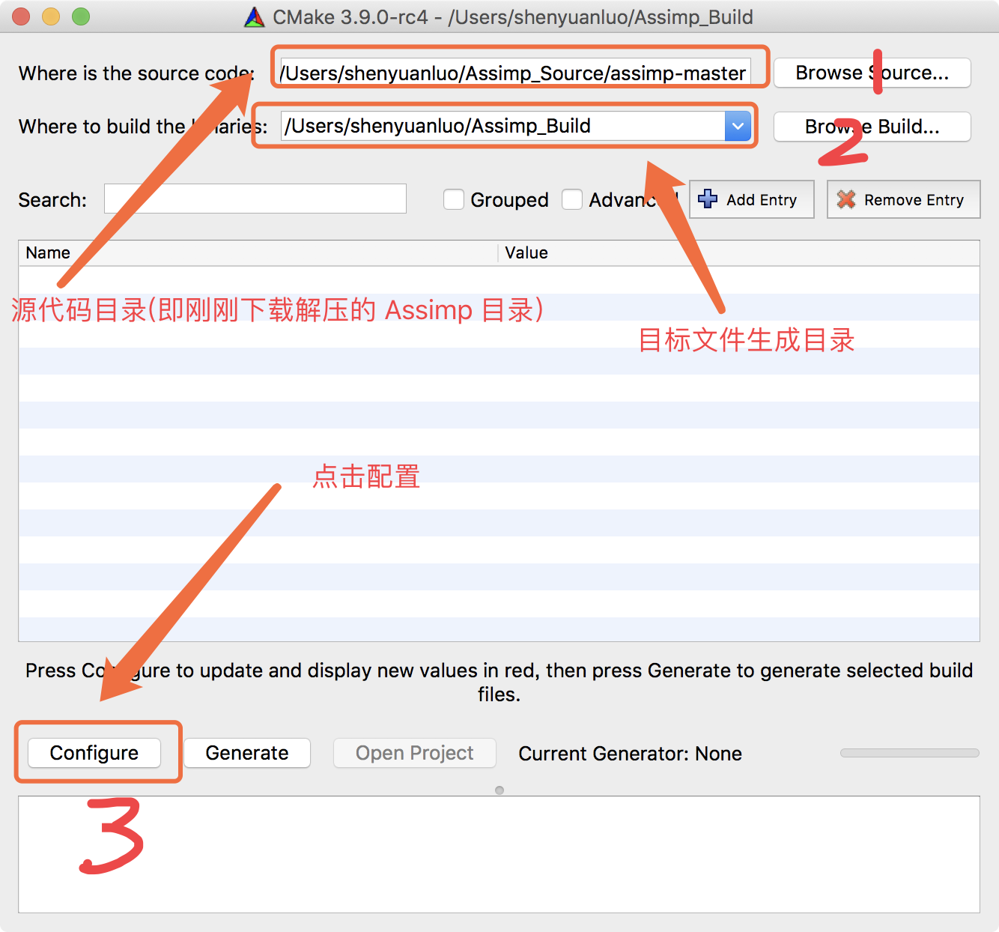
3. 点击 **Configure(设置)** 按钮，让 CMake 读取设置和源代码，然后选择工程的生成器 `Unix Makefiles`。

	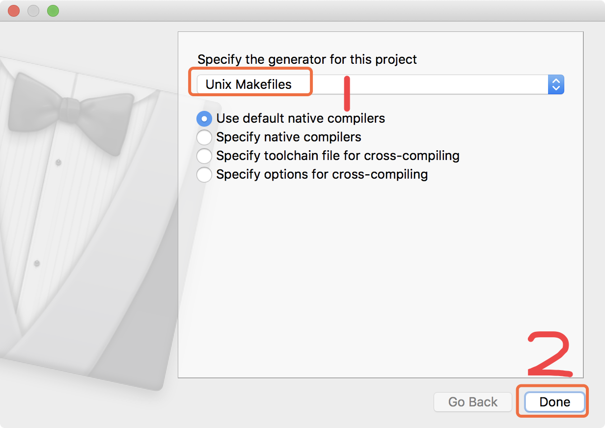
4. 此时会警告没有安装 `minizip`，为处理警告，可以安装了minizip。

	在终端输入：
	``` bash
	$ ruby -e "$(curl -fsSL https://raw.githubusercontent.com/Homebrew/install/master/install)" < /dev/null 2> /dev/null
	```
	
	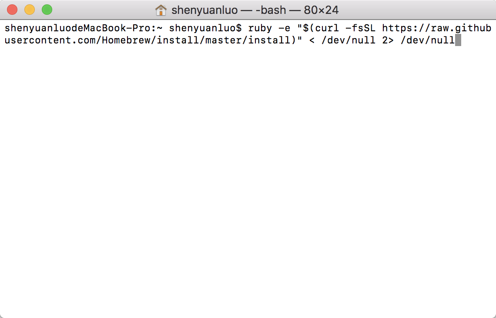
	
	
	
	等待处理完毕，输入：
	
	``` bash
	$ brew install minizip
	```
	
	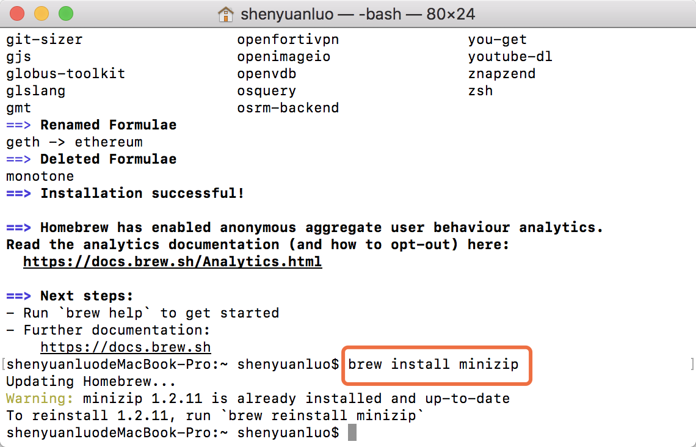
5. 完成安装 `minizip` 后，再次 **configure**。
6. CMake 会显示可选的编译选项用来配置最终生成的库。这里使用默认设置，并再次点击Configure(设置)按钮保存设置。

	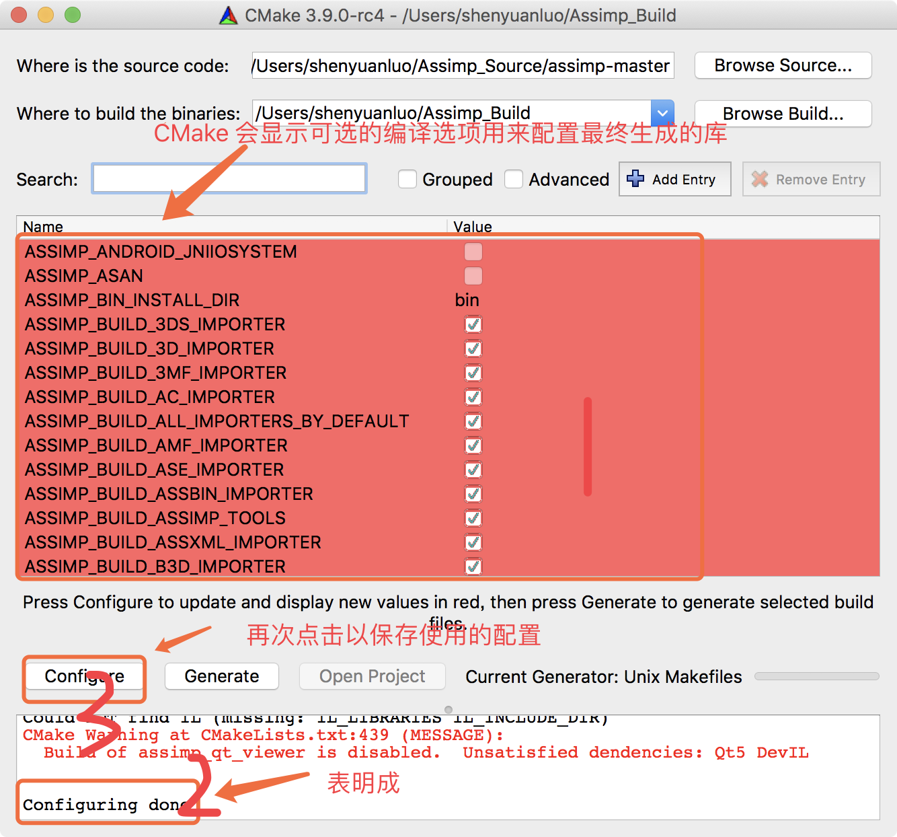
7. 保存之后，点击 **Generate(生成)** 按钮，生成的工程文件会在 `Build` 文件夹中。

	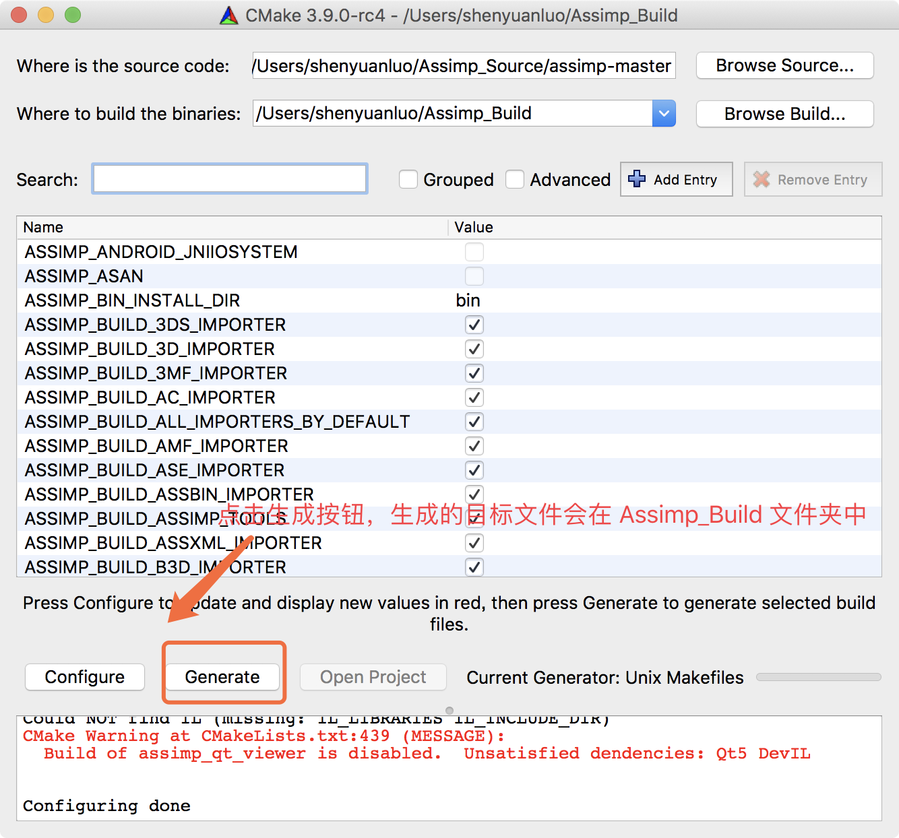
	
	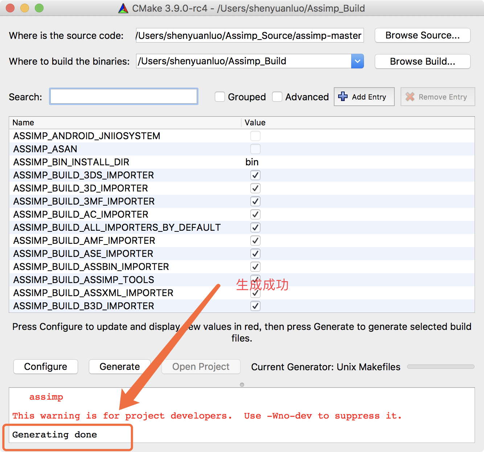
	
	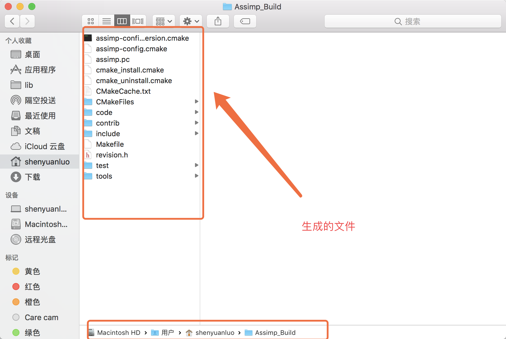
8. 打开终端，**cd** 进入 `Assimp_Build` 目录

	``` bash
	$ cd ~/Assimp_Build
	```
9. 执行 **make** 命令进行编译安装库文件。

	``` bash
	$ make
	```
	
	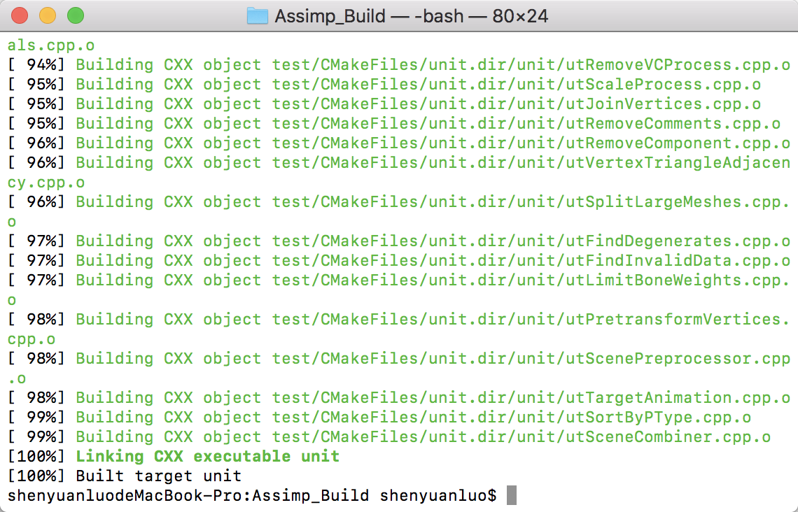
	
10. 执行 **make install** 命令进行安装，将会安装到 `/usr/local/include` 和 `/usr/local/lib` 中。

	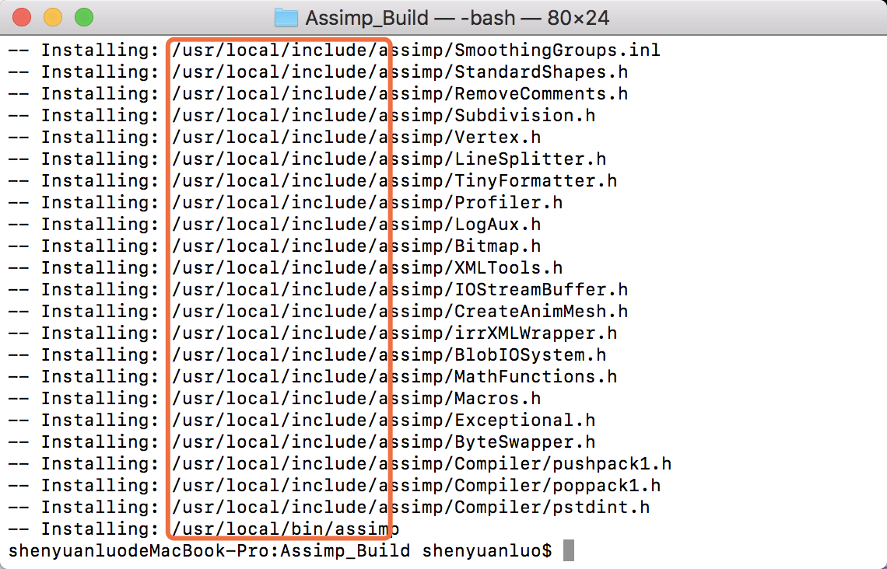
	
	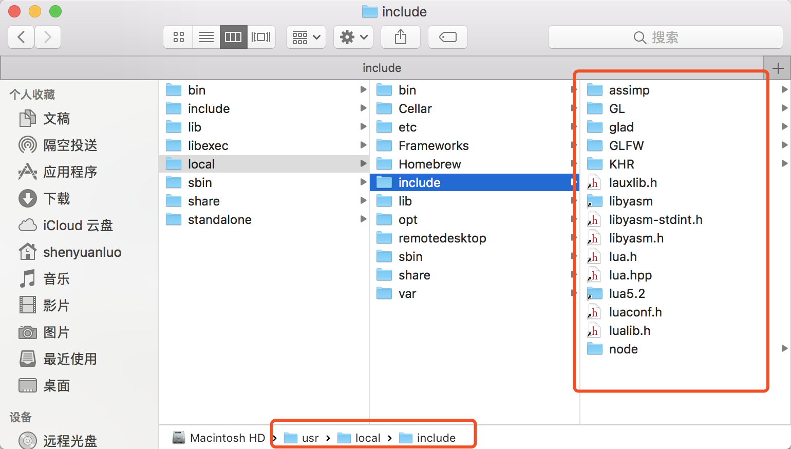
	
	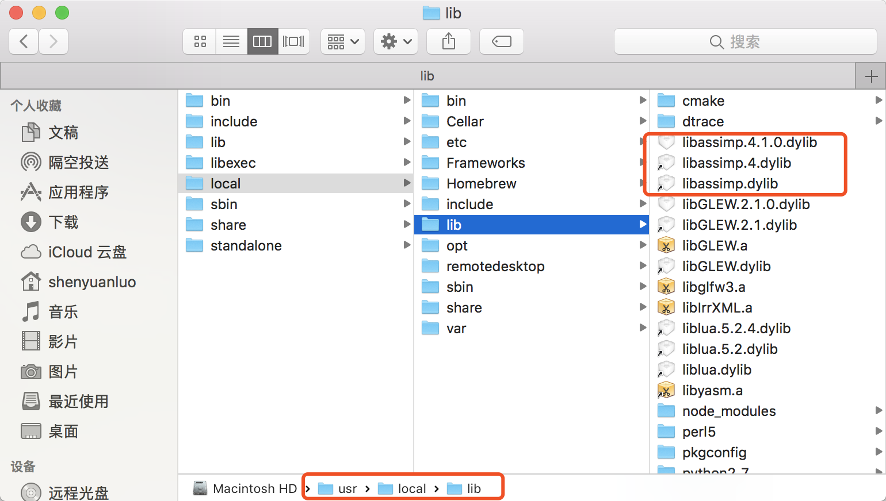
	
	


---

# 参考
教程来源：[https://learnopengl.com/](https://learnopengl.com/Model-Loading/Assimp)。