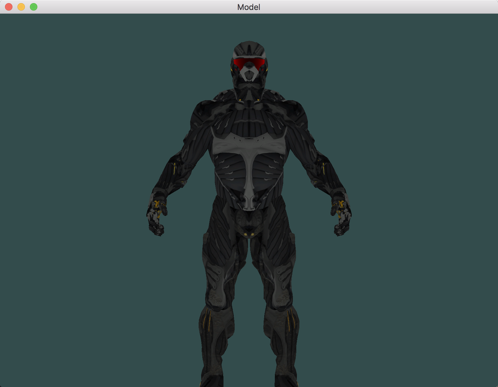

# OpenGL学习笔记（二十）—— Model

---

> 使用 **Assimp** 导入模型。

## Model.hpp
``` C
/*
 C++结构体有个特性，它们的内存布局是连续的(Sequential)
 */
// 顶点结信息 结构体
typedef struct __vertex {
    glm::vec3 Position;     // 位置向量
    glm::vec3 Normal;       // 法向量
    glm::vec2 TexCoords;    // 纹理坐标向量
    glm::vec3 Tangent;      // 切线向量
    glm::vec3 Bitangent;    // 副切线向量
}VertexInfo;

// 纹理信息 结构体
typedef struct __texture {
    GLuint tId;             // 纹理 ID
    std::string type;       // 纹理类型（漫反射贴图：texture_diffuse、镜面光贴图：texture_specular）
    std::string path;       // 纹理图片路径（用于与其它纹理进行比较）
}TextureInfo;


class Mesh
{
private:
    // 渲染数据
    GLuint m_VAO;
    GLuint m_VBO;
    GLuint m_EBO;
    
    
    /**
     设置网格数据
     */
    void setupMesh();
    
public:
    // 网格数据
    std::vector<VertexInfo> m_vertices;     // 顶点
    std::vector<GLuint> m_indices;          // 索引
    std::vector<TextureInfo> m_textures;    // 纹理
    
    Mesh(std::vector<VertexInfo> vertices, std::vector<GLuint> indices, std::vector<TextureInfo> textures);
    
    ~Mesh();
    
    
    /**
     渲染网格

     @param shader 着色器
     */
    void draw(Shader shader);
};
```

## Model.cpp
``` C
#pragma mark - Public
Mesh::Mesh(std::vector<VertexInfo> vertices, std::vector<GLuint> indices, std::vector<TextureInfo> textures)
{
    m_vertices = vertices;
    m_indices  = indices;
    m_textures = textures;
    
    setupMesh();
}

Mesh::~Mesh()
{
    
}

/*
 设定一个命名标准：
 每个漫反射纹理被命名为：texture_diffuseN，
 每个镜面光纹理应该被命名为：texture_specularN，
 其中 N 的范围是 1 到纹理采样器最大允许的数字。
 */
void Mesh::draw(Shader shader)
{
    GLuint diffuseNr  = 1;
    GLuint specularNr = 1;
    GLuint normalNr   = 1;
    GLuint heightNr   = 1;
    
    for (GLuint i = 0; i < m_textures.size(); i++)
    {
        // 在绑定之前先激活响应的纹理单元
        glActiveTexture(GL_TEXTURE0 + i);
        // 获取纹理序号（texture_diffuseN 中的 N）
        std::string number;
        std::string name = m_textures[i].type;
        // 转换：数字 ——> 字符
        if ("texture_diffuse" == name)          // 漫反射纹理
        {
            number = std::to_string(diffuseNr++);
        }
        else if ("texture_specular" == name)    // 镜面光纹理
        {
            number = std::to_string(specularNr++);
        }
        else if ("texture_normal" == name)      // 法线纹理
        {
            number = std::to_string(normalNr++);
        }
        else if ("texture_height" == name)      // 高度纹理
        {
            number = std::to_string(heightNr++);
        }
        
        // 设置纹理单元序号
        shader.setUniformInt((name + number).c_str(), i);
        glBindTexture(GL_TEXTURE_2D, m_textures[i].tId);
    }
    
    // 绘制网格
    glBindVertexArray(m_VAO);
    glDrawElements(GL_TRIANGLES, (GLsizei)m_indices.size(), GL_UNSIGNED_INT, 0);
    glBindVertexArray(0);
    
    // 设置回默认值
    glActiveTexture(GL_TEXTURE0);
}


#pragma mark - Private

void Mesh::setupMesh()
{
    glGenVertexArrays(1, &m_VAO);
    glGenBuffers(1, &m_VBO);
    glGenBuffers(1, &m_EBO);
    
    glBindVertexArray(m_VAO);
    
    // 顶点数据
    glBindBuffer(GL_ARRAY_BUFFER, m_VBO);
    glBufferData(GL_ARRAY_BUFFER, m_vertices.size() * sizeof(VertexInfo), &m_vertices[0], GL_STATIC_DRAW);
    
    // 索引数据
    glBindBuffer(GL_ELEMENT_ARRAY_BUFFER, m_EBO);
    glBufferData(GL_ELEMENT_ARRAY_BUFFER, m_indices.size() * sizeof(GLuint), &m_indices[0], GL_STATIC_DRAW);
    
    /*
     结构体预处理指令 offsetof(s, m)，第一个参数是一个结构体，第二个参数是这个结构体中变量的名字。
     这个宏会返回那个变量距结构体头部的字节偏移量(Byte Offset)。
     */
    // 顶点位置属性
    glEnableVertexAttribArray(0);
    glVertexAttribPointer(0, 3, GL_FLOAT, GL_FALSE, sizeof(VertexInfo), (void*)offsetof(VertexInfo, Position));
    
    // 顶点法线属性
    glEnableVertexAttribArray(1);
    glVertexAttribPointer(1, 3, GL_FLOAT, GL_FALSE, sizeof(VertexInfo), (void *)offsetof(VertexInfo, Normal));
    
    // 纹理坐标
    glEnableVertexAttribArray(2);
    glVertexAttribPointer(2, 2, GL_FLOAT, GL_FALSE, sizeof(VertexInfo), (void*)offsetof(VertexInfo, TexCoords));
    
    // 纹理切线
    glEnableVertexAttribArray(3);
    glVertexAttribPointer(3, 3, GL_FLOAT, GL_FALSE, sizeof(VertexInfo), (void*)offsetof(VertexInfo, Tangent));
    
    // 纹理双切线
    glEnableVertexAttribArray(4);
    glVertexAttribPointer(4, 3, GL_FLOAT, GL_FALSE, sizeof(VertexInfo), (void*)offsetof(VertexInfo, Bitangent));
    
    // 解绑 VOA
    glBindVertexArray(0);
}
```


# 效果


---


# 参考
教程来源：[https://learnopengl.com/](https://learnopengl.com/Model-Loading/Model)。