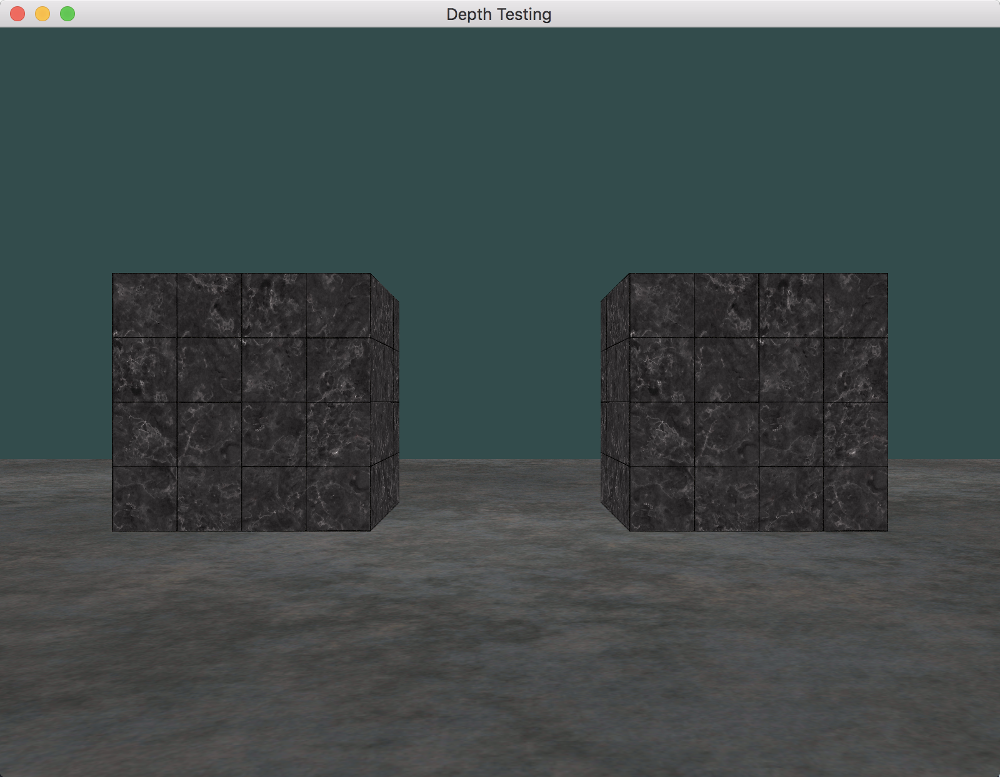
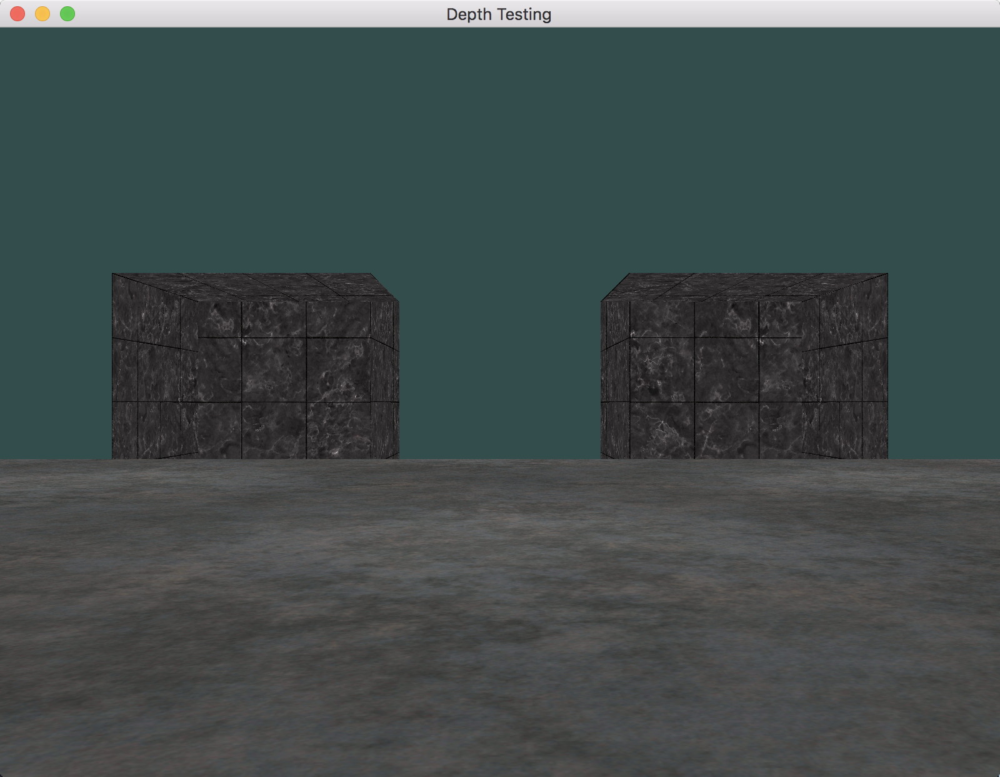
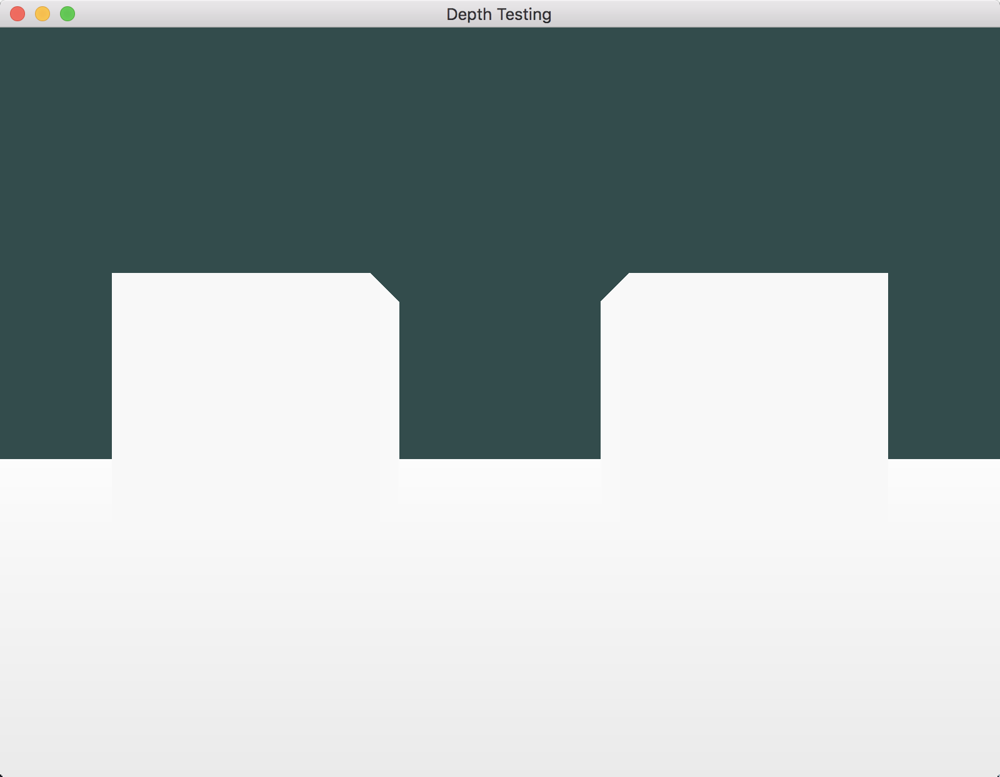
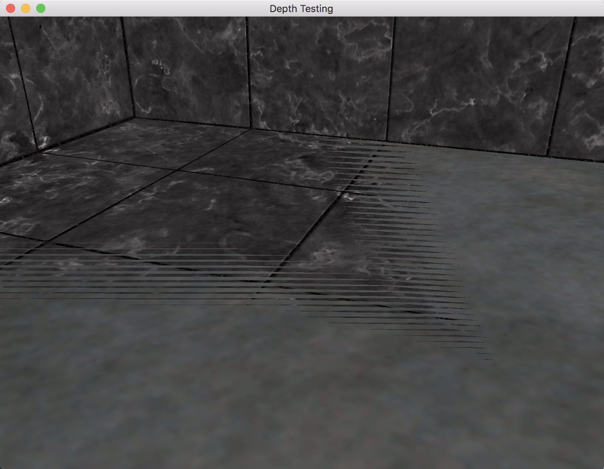
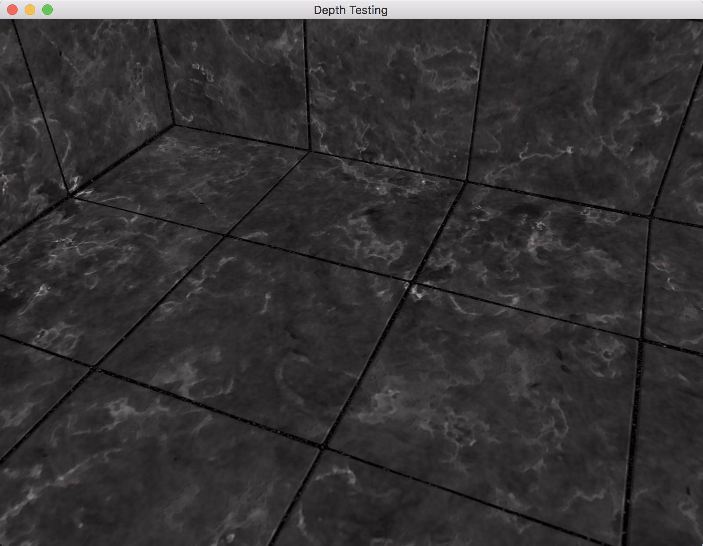

#  Depth Testing

---

1. 场景效果：

	
2. 将深度函数改为 `GL_ALWAYS`：

	
3. 将（线性）深度值输出为颜色：

	
4. 将（非线性）深度值输出为颜色：

	
5. 深度冲突（箱子底面与地平面）：

	
6. 防止深度冲突（箱子底面与地平面）：

	

---

# 参考
教程来源：[https://learnopengl.com/](https://learnopengl.com/Advanced-OpenGL/Depth-testing)。