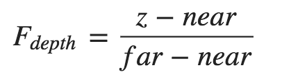
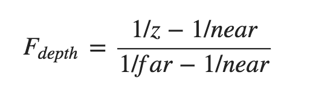

# OpenGL学习笔记（二十一）—— Depth Testing

---

## 深度缓冲
**深度缓冲 或 `z` 缓冲(z-buffer)：**就像颜色缓冲(Color Buffer)（储存所有的片段颜色：视觉输出）一样，在每个片段中储存了信息，并且（通常）和颜色缓冲有着一样的宽度和高度。深度缓冲是由窗口系统自动创建的，它会以 `16`、`24` 或 `32` 位 *float* 的形式储存它的深度值。在大部分的系统中，深度缓冲的精度都是24位的。

当深度测试(Depth Testing)被启用的时候，`OpenGL` 会执行一个深度测试，**如果这个测试通过了的话，就会绘制该片段并将深度缓冲将会更新为新的深度值(前提是深度缓冲允许写入)。如果深度测试失败了，片段将会被丢弃不更新缓冲**。

屏幕空间坐标可以直接使用 `GLSL` 内建变量 **gl_FragCoord** 从片段着色器中直接访问；其 `x` 和 `y` 分量代表了片段的屏幕空间坐标（其中 `(0, 0)` 位于左下角）；`z` 分量，代表了片段真正的深度值（就是需要与深度缓冲内容所对比的那个值）。

注意：如果启用了深度缓冲，必需在每个渲染迭代之前使用 `GL_DEPTH_BUFFER_BIT` 来清除深度缓冲，否则会仍在使用上一次渲染迭代中的写入的深度值：`glClear(GL_COLOR_BUFFER_BIT | GL_DEPTH_BUFFER_BIT);`

## 深度测试函数
可以调用 `glDepthFunc` 函数来设置**比较运算符**（或者说**深度函数(Depth Function)**）：

``` C
glDepthFunc(GLenum func);
```

其中参数 `func` 可以使用的 **比较运算符**：

| 函数 | 描述 |
| -------- | -------- |
| `GL_ALWAYS` | 永远通过深度测试 |
| `GL_NEVER` | 永远不通过深度测试 |
| `GL_LESS` | 在片段深度值小于（ `＜` ）缓冲的深度值时通过测试（默认情况） |
| `GL_EQUAL` | 在片段深度值等于（ `＝` ）缓冲区的深度值时通过测试 |
| `GL_LEQUAL` | 在片段深度值小于等于（ `≤` ）缓冲区的深度值时通过测试 |
| `GL_GREATER` | 在片段深度值大于（ `＞` ）缓冲区的深度值时通过测试 |
| `GL_GEQUAL` | 在片段深度值大于等于（ `≥` ）缓冲区的深度值时通过测试 |
| `GL_NOTEQUAL` | 在片段深度值不等于（ `≠` ）缓冲区的深度值时通过测试 |


## 深度值精度
深度缓冲包含了一个介于 **[0.0, 1.0]** 之间的深度值，与观察空间中的物体的 `z` 值进行比较；其值可能是投影平截头体的近平面(Near)和远平面(Far)之间的任何值；

- 一种方式是通过以下 **线性方程**（*很少用*）将 `z` 值变换到了 **[0.0, 1.0]** 之间的深度值：

	

	`z` 值和对应的 `深度值` 之间的关系如图所示：

	

	> 由图可以看出：物体越接近 **近平面** 的时候，深度值越接近 `0.0`；而当物体越接近 **远平面** 的时候，深度值越接近 `1.0`。
	
- 另一种方式是通过以下 **非线性方程**（*常用*）将 `z` 值变换到了 **[0.0, 1.0]** 之间的深度值：
	
	
	
	`z` 值和对应的 `深度值` 之间的关系如图所示：
	
	
	
> 这里的 `near` 和 `far` 值是给投影矩阵设置可视平截头体的那个 `near` 和 `far` 值。


## 深度缓冲的可视化
- 将（非线性）深度值输出为颜色，显示场景中所有片段的深度值：

	``` c
	void main()
	{
	    FragColor = vec4(vec3(gl_FragCoord.z), 1.0);
	}
	```
- 将（非线性）深度值输出为颜色，显示场景中所有片段的深度值：

	``` C
	#version 330 core
	out vec4 FragColor;
	
	float near = 0.1; 
	float far  = 100.0; 
	
	float LinearizeDepth(float depth) 
	{
	    float z = depth * 2.0 - 1.0; // 将深度值变换为 NDC
	    return (2.0 * near * far) / (far + near - z * (far - near));    
	}
	
	void main()
	{             
	    float depth = LinearizeDepth(gl_FragCoord.z) / far; // 为了演示除以 far
	    FragColor = vec4(vec3(depth), 1.0);
	}
	```
	

## 深度冲突
**深度冲突(Z-fighting)：**在两个平面或者三角形非常紧密地平行排列在一起时，由于深度缓冲没有足够的精度来决定两个形状哪个在前面，导致这两个形状不断地在切换前后顺序，所引起的奇怪的花纹现象。（当物体在远处时效果会更明显（因为深度缓冲在 `z` 值比较大的时候有着更小的精度））


## 防止深度冲突
深度冲突不能够被完全避免，但一般会有一些技巧有助于在场景中减轻或者完全避免深度冲突；例如：

- 永远不要把多个物体摆得太靠近，以至于它们的一些三角形会重叠。

	> 通过在两个物体之间设置一个用户无法注意到的偏移值，可以完全避免这两个物体之间的深度冲突。
- 尽可能将 **近平面** 设置远一些。

	> 因为精度在靠近近平面时是非常高的，所以如果将近平面远离观察者，将会对整个平截头体有着更大的精度；但是不能将近平面设置太远，否则将会导致近处的物体被裁剪掉。
- 使用更高精度的深度缓冲。

	> 大部分深度缓冲的精度都是 `24` 位的，但现在大部分的显卡都支持 `32` 位的深度缓冲，这将会极大地提高精度；因此，牺牲掉一些性能，就能获得更高精度的深度测试，减少深度冲突。


---


# 参考
教程来源：[https://learnopengl.com/](https://learnopengl.com/Advanced-OpenGL/Depth-testing)。