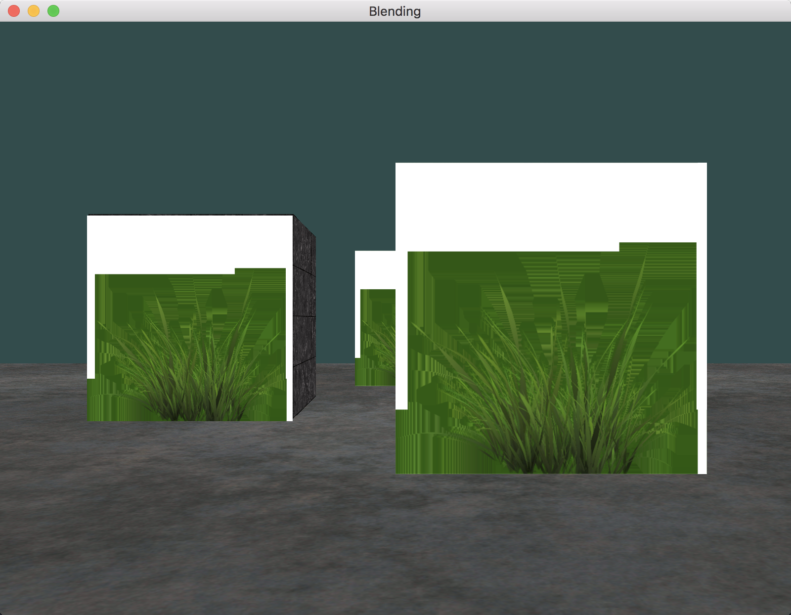
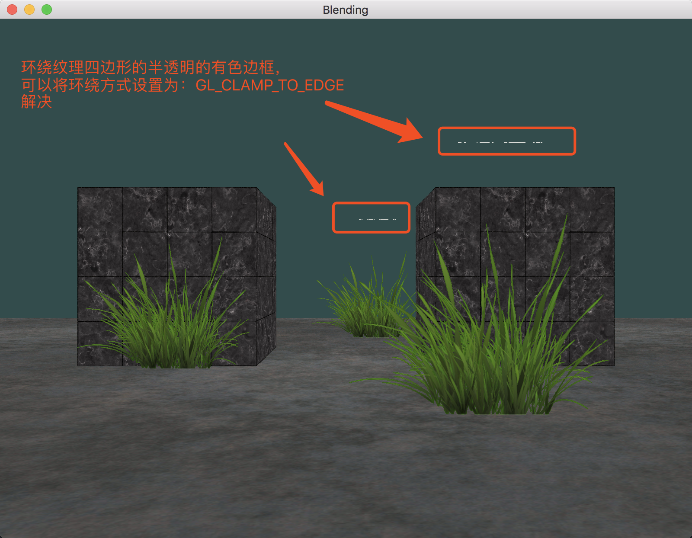
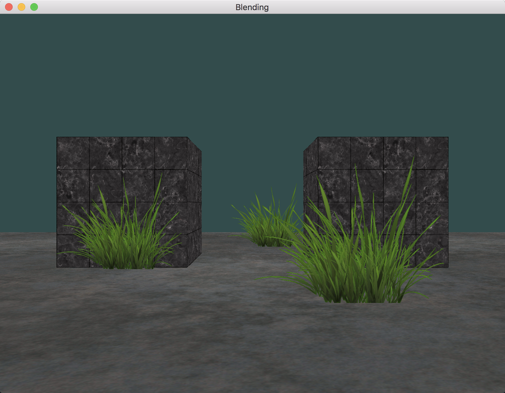

# Blending

---

1. 没有丢弃（discard）草的透明片段效果：

	
2. 丢弃（discard）草的透明片段效果（没有处理边缘的插值）：

	
3. 丢弃（discard）草的透明片段效果（处理边缘的插值）：

	

---

# 参考
教程来源：[https://learnopengl.com/](https://learnopengl.com/Advanced-OpenGL/Blending)。