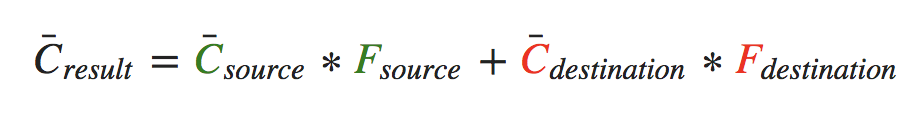

# OpenGL学习笔记（二十三）—— Blending

---

## 概述
**混合(Blending)：**通常是 `OpenGL` 实现物体透明度（通过颜色的 `aplha` 值，即颜色向量的第四个分量来决定的。）的一种技术。

**透明(Transparency)：**指的是一个物体（或者其中的一部分）不是纯色(Solid Color)的，其颜色是物体本身的颜色和它背后其它物体的颜色的不同强度结合。


## 丢弃片段
有些图片纹理并不需要半透明，只需要根据纹理颜色值，显示一部分（完全不透明，`alpha` 值为 `1.0`），或者不显示一部分（完全透明，`alpha` 值为 `0.0`），没有中间情况；对这样的图片纹理将要 **丢弃(Discard)** 纹理中透明部分的片段，不将这些片段存储到颜色缓冲中。如图：


使用 `GLSL` 的 **discard** 命令，保证片段不会被进一步处理，即不会进入颜色缓冲。所以在片段着色器中检测一个片段的 `alpha` 值是否低于某个阈值，如果是的话，则丢弃这个片段。

``` C
#version 330 core

in vec2 TexCoords;

out vec4 FragColor;

uniform sampler2D texture1;

void main()
{             
    vec4 texColor = texture(texture1, TexCoords);
    if(texColor.a < 0.1)
    {
        discard;
    }
    FragColor = texColor;
}
```

**注意：**丢弃片段的方式，不能很好处理半透明的纹理。

## 混合
片段着色器运行完成后，在所有的测试都通过之后，将会应用以下方程进行 `片段颜色值` 与 `颜色缓冲值` 进行 **混合**：



- **C¯source：**源颜色向量；这是源自纹理的颜色向量。
- **C¯destination：**目标颜色向量；这是当前储存在颜色缓冲中的颜色向量。
- **Fsource：**源因子值；指定了 `alpha` 值对源颜色的影响。
- **Fdestination：**目标因子值；指定了 `alpha` 值对目标颜色的影响。

> 源颜色和目标颜色将会由 `OpenGL` 自动设定，但源因子和目标因子的值可以由开发者来决定。

### 混合因子设置
1. 混合因子的设置有一个专门的函数：**glBlendFunc(GLenum sfactor, GLenum dfactor)**；

	- **sfactor：**设置源颜色因子值；
	- **dfactor：**设置目标颜色因子值；
	
		> 其中常用的选项如下：
		
		| 选项 | 值 |
		| -------- | -------- |
		| `GL_ZERO` | 因子等于 `0` |
		| `GL_ONE` | 因子等于 `1` |
		| `GL_SRC_COLOR` | 因子等于源颜色向量 `C¯source` |
		| `GL_ONE_MINUS_SRC_COLOR` | 因子等于 `1 − C¯source` |
		| `GL_DST_COLOR` | 因子等于目标颜色向量 `C¯destination` |
		| `GL_ONE_MINUS_DST_COLOR` | 因子等于 `1 − C¯destination` |
		| `GL_SRC_ALPHA` | 因子等于 `C¯source` 的 `alpha` 分量 |
		| `GL_ONE_MINUS_SRC_ALPHA` | 因子等于 `1 − C¯source` 的 `alpha` 分量 |
		| `GL_DST_ALPHA` | 因子等于 `C¯destination` 的 `alpha` 分量 |
		| `GL_ONE_MINUS_DST_ALPHA` | 因子等于 `1 − C¯destination` 的 `alpha` 分量 |
		| `GL_CONSTANT_COLOR` | 因子等于常数颜色向量 `C¯constant` |
		| `GL_ONE_MINUS_CONSTANT_COLOR` | 因子等于 `1 − C¯constant` |
		| `GL_CONSTANT_ALPHA` | 因子等于 `C¯constant` 的 `alpha` 分量 |
		| `GL_ONE_MINUS_CONSTANT_ALPHA` | 因子等于 `1 − C¯constant` 的 `alpha` 分量 |
		
		> **注意：**以上选项中常数颜色向量 `C¯constant` 可以通过 `glBlendColor` 函数来另外设置。
2. 也可以使用 **glBlendFuncSeparate(GLenum sfactorRGB, GLenum dfactorRGB, GLenum sfactorAlpha, GLenum dfactorAlpha);** 为 `RGB` 和 `alpha` 通道分别设置不同的选项：

	- **sfactorRGB：**源颜色·RGB 值；
	- **dfactorRGB：**目标颜色·RGB 值；
	- **sfactorAlpha：**源颜色·alpha 值；
	- **dfactorAlpha：**目标颜色·alpha 值；

3. 通过使用**glBlendEquation(GLenum mode);**来改变方程中源和目标部分的 `运算符`，其 `mode` 提供了三个选项：

	| 选项 | 值 |
	| -------- | -------- |
	| `GL_FUNC_ADD` | 将两个分量相加：`C¯result = Src + Dst` (默认选项) |
	| `GL_FUNC_SUBTRACT` | 将两个分量相减： `C¯result = Src − Dst` |
	| `GL_FUNC_REVERSE_SUBTRACT` | 将两个分量相减，但顺序相反：`C¯result = Dst − Src` |
	
	
## 渲染半透明纹理
通过混合渲染半透明的的纹理时，容易出现一个问题，就是前面的半透明的物体（如窗户）会挡住后面的半透明物体，达不到理想的效果；因为当写入深度缓冲时，深度缓冲不会检查片段是否是透明的，所以透明的部分会和其它值一样写入到深度缓冲中；因此可以通过先绘制远处的半透明物体，再绘制近的半透明的物体来避免这个问题。

## 混合顺序
通常比较理想的混合，是最先绘制 `最远` 的物体，最后绘制 `最近`的物体。

当绘制一个有不透明和透明物体的场景的时候，大体的原则如下：

1. 先绘制所有不透明的物体。
2. 对所有透明的物体排序。
3. 按顺序(`由远到近`)绘制所有透明的物体。

排序透明物体的一种方法是，从观察者视角获取物体的距离。


---


# 参考
教程来源：[https://learnopengl.com/](https://learnopengl.com/Advanced-OpenGL/Blending)。