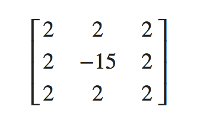
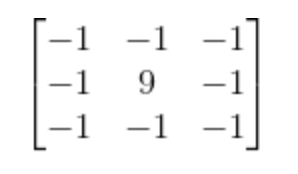
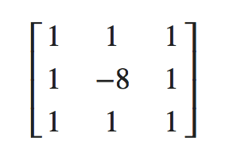

# OpenGL学习笔记（二十五）—— Frame Buffers

---

## 前言
> 在 `OpenGL` 的渲染管线中，用于存储颜色值和测试结果的二维数组的几何被称为 **帧缓冲区（frame buffer）**。这些二维数组按用途划分，可分为 **颜色缓冲区（color buffer）**，**深度缓冲区（depth buffer）**，**模版缓冲区（stencil buffer）**。
> 
> 当创建了一个可供 `OpenGL` 绘制用的窗体后，窗体系统会为自动生成一个默认的帧缓冲区，这个帧缓冲区完全是由窗体系统来管理的，且仅用于 **将渲染后的图像输出到窗口的显示区域**。

窗体系统创建的帧缓冲区也有对应的帧缓冲区对象(Framebuffer-Object：FBO)的实例。但是，这个 `FBO` 与额外创建的 `FBO` 相比有许多不同：

- 通过额外创建的 `FBO` 不能用于将渲染结果直接显示到窗口输出区，只能用于离屏渲染（Off-screen Rendering）；
- 窗体系统生成的 `FBO` 在创建的时候就拥有颜色缓冲区，深度缓冲区，模版缓冲区，且创建后就为这些缓冲区分配了空间；而额外创建的FBO需要手动为其添加各个缓冲区，并为其申请空间。
- 窗体系统创建的 `FBO` 中的各个缓冲区对象不能与手动创建的 `FBO` 混用。

## 帧缓冲
把用于写入颜色值的 `颜色缓冲`，用于写入深度信息的 `深度缓冲` 和根据一些条件丢弃特定片段的 `模板缓冲` 结合起来叫做 **帧缓冲(Framebuffer)**。

一个完整的帧缓冲需要满足以下的条件：

- 附加至少一个缓冲（颜色、深度或模板缓冲）。
- 至少有一个颜色附件(Attachment)。
- 所有的附件都必须是完整的（保留了内存）。
- 每个缓冲都应该有相同的样本数。

> **附件** 是一个内存位置，它能够作为帧缓冲的一个缓冲(可以将它想象为一个图像)。当创建一个附件的时候有两个选项：`纹理附件` 或 `渲染缓冲对象(Renderbuffer Object)附件`。

通过使用**`GLenum glCheckFramebufferStatus(	GLenum target);`** 以 `GL_FRAMEBUFFER` 作为参数检测当前绑定的帧缓冲，根据返回值来判断是否完整(如果是 `GL_FRAMEBUFFER_COMPLETE`，则完整，更多返回值参看 [这里](https://www.khronos.org/registry/OpenGL-Refpages/gl4/html/glCheckFramebufferStatus.xhtml))。


## 离屏渲染
当自定义的帧缓冲(不是默认缓冲)是完整的并且已经绑定激活，之后所有的渲染操作将会渲染到当前绑定帧缓冲的附件中；此时渲染指令将不会对窗口的视觉输出有任何影响。这种渲染到一个不同的帧缓冲被叫做 **离屏渲染(Off-screen Rendering)**。

如果要保证所有的渲染操作在主窗口中有视觉效果，需要再次激活默认帧缓冲（将它绑定到 `0`）：

``` C
glBindFramebuffer(GL_FRAMEBUFFER, 0);
```


## 纹理附件
当把一个纹理附加到帧缓冲的时候，所有的渲染指令将会写入到这个纹理中，就像是一个普通的 `颜色`/`深度`或`模板`缓冲一样。使用纹理的优点是，所有渲染操作的结果将会被储存在一个纹理图像中。

1. 创建帧缓冲(颜色)纹理附件大致如下：

	``` C
	unsigned int texture;
	glGenTextures(1, &texture);
	glBindTexture(GL_TEXTURE_2D, texture);
	
	glTexImage2D(GL_TEXTURE_2D, 0, GL_RGB, 800, 600, 0, GL_RGB, GL_UNSIGNED_BYTE, NULL);
	
	glTexParameteri(GL_TEXTURE_2D, GL_TEXTURE_MIN_FILTER, GL_LINEAR);
	glTexParameteri(GL_TEXTURE_2D, GL_TEXTURE_MAG_FILTER, GL_LINEAR);
	```

	为帧缓冲创建一个纹理和创建一个普通的纹理主要区别在于：
	
	- 将维度设置为了屏幕大小（但不是必须的）；
	- 给纹理的 **data** 参数传递了 `NULL`；
	- 对于这个纹理，仅仅分配了内存而没有填充它（填充这个纹理将会在渲染到帧缓冲之后来进行）；
	- 无需设置 `环绕方式` 或 `多级渐远纹理`（因为在大多数情况下都不会需要）；
2. 通过使用 **glFrameBufferTexture2D(GLenum target, GLenum attachment, GLenum textarget, GLuint texture, GLint level)** 将（纹理）附件附加到帧缓冲上：
	
	- **target：**帧缓冲的目标：
	
		- `GL_DRAW_FRAMEBUFFER`：绘制；
		- `GL_READ_FRAMEBUFFER`：读取；
		- `GL_FRAMEBUFFER`：（绘制、读取）两者皆有；
	- **attachment：**附加的附件(缓冲)类型：

		- `GL_COLOR_ATTACHMENT0`：颜色附件(缓冲)（可以附加多个）；
		
			>（在**glTexImage2D**将格式(Format)和内部格式(Internalformat)设置为：`GL_RGB`）。
		- `GL_DEPTH_ATTACHMENT`：深度附件(缓冲)；

			>（在**glTexImage2D**将格式(Format)和内部格式(Internalformat)：`GL_DEPTH_COMPONENT`）。
		- `GL_STENCIL_ATTACHMENT`：模板附件(缓冲)；

			>（在**glTexImage2D**将格式(Format)设置为：`GL_STENCIL_ATTACHMENT`，将内部格式(Internalformat)设置为：`GL_STENCIL_INDEX`）。
	- **textarget：**附加的纹理类型（如 2D 纹理：`GL_TEXTURE_2D`）。
	- **texture：**附加的纹理本身。
	- **level：**多级渐远纹理的级别（通常保留为 `0`）。
3. 除了颜色附件之外，也可以将一个深度和模板缓冲附加为一个纹理到帧缓冲：

	``` C
	glTexImage2D(GL_TEXTURE_2D, 0, GL_DEPTH24_STENCIL8, 800, 600, 0, GL_DEPTH_STENCIL, GL_UNSIGNED_INT_24_8, NULL);
	
	glFramebufferTexture2D(GL_FRAMEBUFFER, GL_DEPTH_STENCIL_ATTACHMENT, GL_TEXTURE_2D, texture, 0);
	```
> 纹理的每 `32` 位数值将包含 `24` 位的深度信息和 `8`位的模板信息。


## 渲染缓冲对象附件
1. **渲染缓冲对象(Renderbuffer Object)：**是在纹理之后（在过去纹理是唯一可用的附件）引入到 `OpenGL` 中，作为一个可用的帧缓冲附件类型的。其好处是，将数据储存为 `OpenGL` 原生的渲染格式，是为离屏渲染到帧缓冲优化过的。
2. 渲染缓冲对象直接将所有的渲染数据储存到它的缓冲中，不会做任何针对纹理格式的转换，让它变为一个更快的可写储存介质。所以你不能读取它们（比如使用纹理访问），但仍然还是能够使用 **glReadPixels** 来读取它，这会从当前绑定的帧缓冲，而不是附件本身，中返回特定区域的像素。
3. 通过使用**glFramebufferRenderbuffer(GLenum target, GLenum attachment, GLenum renderbuffertarget, GLuint renderbuffer);** 附加渲染缓冲对象到帧缓冲中：

> 由于渲染缓冲对象通常都是只写的，会经常用于深度和模板附件，因为大部分时间我们都不需要从深度和模板缓冲中读取值，只关心深度和模板测试。

### 渲染缓冲和纹理附件区别：
创建一个渲染缓冲对象和纹理对象类似，其区别在于：

- 渲染缓冲对象附件是专门被设计作为图像使用的，
- 纹理附件通用数据缓冲(General Purpose Data Buffer)。


### 渲染缓冲对象和纹理使用一般规则：
通常的规则是，如果不需要从一个缓冲中采样数据，则选择使用使用渲染缓冲对象附件。如果需要从缓冲中采样颜色或深度值等数据，则选择纹理附件。

## 渲染到纹理
帧缓冲创建大致流程：

1. 创建帧缓冲并绑定：

	``` C
	GLuint frameBuffer; // 帧缓冲对象
   glGenFramebuffers(1, &frameBuffer); // 生成帧缓冲对象
   glBindFramebuffer(GL_FRAMEBUFFER, frameBuffer); // 绑定帧缓冲
	```
2. 创建帧缓冲 **纹理附件**，并将其作为 *颜色缓冲* 添加到帧缓冲上：

	``` C
	GLuint texColorBuffer;	// 纹理附件
   glGenTextures(1, &texColorBuffer);  // 生成纹理
   glBindTexture(GL_TEXTURE_2D, texColorBuffer);   // 绑定纹理对象到激活 2D 纹理中
   glTexImage2D(GL_TEXTURE_2D, 0, GL_RGB, 800, 600, GL_RGB, GL_UNSIGNED_BYTE, NULL);   // 创建纹理图像（注意：暂时没有填充图像数据）
   glTexParameteri(GL_TEXTURE_2D, GL_TEXTURE_MIN_FILTER, GL_LINEAR);   // 纹理缩小过滤方式：线性过滤
   glTexParameteri(GL_TEXTURE_2D, GL_TEXTURE_MAG_FILTER, GL_LINEAR);   // 纹理放大过滤方式：线性过滤
   glBindTexture(GL_TEXTURE_2D, 0);    // 解绑纹理
   glFramebufferTexture2D(GL_FRAMEBUFFER, GL_COLOR_ATTACHMENT0, GL_TEXTURE_2D, texColorBuffer, 0);   // 将纹理附件添加到帧缓冲上
	```
3. 创建帧缓冲 **渲染缓冲对象附件**，并将其作为 *深度(和模板)缓冲* 添加到帧缓冲上：

	``` C
	GLuint rbo; // 渲染缓冲对象（Render Buffer Object）
   glGenRenderbuffers(1, &rbo);    // 生成渲染缓冲对象
   glBindRenderbuffer(GL_RENDERBUFFER, rbo);   // 绑定渲染缓冲对象
   glRenderbufferStorage(GL_RENDERBUFFER, GL_DEPTH24_STENCIL8, 800, 600);  // 创建渲染缓冲对象
   glBindRenderbuffer(GL_RENDERBUFFER, 0); // 已经分配足够内存的渲染缓冲对象，可以将其解绑
   glFramebufferRenderbuffer(GL_FRAMEBUFFER, GL_DEPTH_ATTACHMENT, GL_RENDERBUFFER, rbo);   // 将渲染缓冲附件添加到帧缓冲上
	```
4. 检查创建的帧缓冲是否完整：

	``` C
	if (GL_FRAMEBUFFER_COMPLETE != glCheckFramebufferStatus(GL_FRAMEBUFFER))
   {
       std::cout << "帧缓冲不完整，创建帧缓冲失败！" << std::endl;
       glBindFramebuffer(GL_FRAMEBUFFER, 0);   // 帧缓冲不完整，需要将其解绑，以免渲染错误
   }
	```
	
绘制场景到一个纹理上大致的步骤：

1. 将新的帧缓冲绑定为激活的帧缓冲，和往常一样渲染场景
2. 绑定默认的帧缓冲
3. 绘制一个横跨整个屏幕的四边形，将帧缓冲的颜色缓冲作为它的纹理。

> **小结：** 帧缓冲的应用原理：
> 
> 1. 先把场景绘制到创建的帧缓冲的纹理（颜色缓冲）附件上；
> 2. 然后默认缓冲绘制覆盖整个窗口的四边形；
> 3. 最后将其纹理贴到四边形中。


## 后期处理
### 反相
从屏幕纹理中取颜色值，然后用 `1.0` 减去它，即可对它进行 **反相**：

``` C
void main()
{
    FragColor = vec4 (vec3 (1.0 - texture(texture1, TexCoords)), 1.0);
}
```

### 灰度
移除场景中除了 `黑`、`白`、`灰` 以外所有的颜色，让整个图像 **灰度化(Grayscale)**：

1. 最简单的方式是，取所有的颜色分量，进行平均化：

	``` C
	void main()
	{
	    FragColor = texture(screenTexture, TexCoords);
	    float average = (FragColor.r + FragColor.g + FragColor.b) / 3.0;
	    FragColor = vec4(average, average, average, 1.0);
	}
	```
2. 由于人眼会对绿色更加敏感一些，而对蓝色不那么敏感，因此使用 **加权的(Weighted)** 通道：

	``` C
	void main()
	{
	    FragColor = texture(screenTexture, TexCoords);
	    float average = 0.2126 * FragColor.r + 0.7152 * FragColor.g + 0.0722 * FragColor.b;
	    FragColor = vec4(average, average, average, 1.0);
	}
	```

### 核效果
**核(Kernel)（或卷积矩阵(Convolution Matrix)）：**是一个类矩阵的数值数组，其中心为当前的像素，它会用它的核值乘以周围的像素值，并将结果相加变成一个值。基本上是在对当前像素周围的纹理坐标添加一个小的偏移量(例如：0.003)，并根据核将结果合并。例如（大大多数都是 `3 x 3` 核）：



这个核取了 `8` 个周围像素值，将它们乘以 `2`，而把当前的像素乘以 `-15`。这个核的例子将周围的像素乘上了一个权重，并将当前像素乘以一个比较大的负权重来平衡结果。

> 大部分核将所有的权重加起来之后都应该会 **等于** `1`，如果它们加起来不等于1，这就意味着最终的纹理颜色将会比原纹理值更亮或者更暗了。

#### 常见的核效果（后期处理）：

1. 锐化(Sharpen)·卷积矩阵：

	
	> 图像锐化(image sharpening)是补偿图像的轮廓，增强图像的边缘及灰度跳变的部分，使图像变得清晰。
2. 模糊(Blur)·卷积矩阵

	
3. 边缘检测(Edge-detection)·卷积矩阵

	
	> 边缘检测的目的是标识数字图像中亮度变化明显的点。
	
> **注意：**核在对屏幕纹理的边缘进行采样的时候，由于还会对中心像素周围的 `8` 个像素进行采样，导致会取到纹理之外的像素。由于默认的环绕方式是 `GL_REPEAT`，因此取到的是屏幕另一边的像素（就可能会在屏幕边缘产生很奇怪的条纹）。
> 
> 所以，将屏幕纹理(即帧缓冲对应的纹理)的环绕方式都设置为 `GL_CLAMP_TO_EDGE`；这样就会在处理边缘像素时，对周围的像素进行采样时，就能够重复边缘的像素来更精确地估计最终的值了。


---


# 参考
教程来源：[https://learnopengl.com/](https://learnopengl.com/Advanced-OpenGL/Framebuffers)。