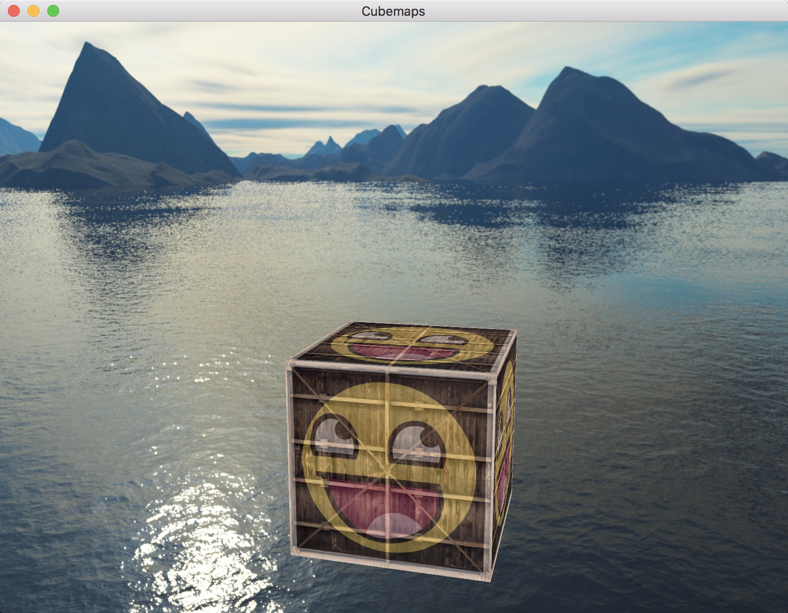

# OpenGL学习笔记（二十六）—— Cube Maps

---


## 立方体贴图
**立方体贴图(Cube Map)：**将多个纹理组合起来映射到一张纹理上的一种纹理（简单来说，就是一个包含了 `6` 个 `2D` 纹理的纹理，每个 `2D` 纹理都组成了立方体的一个面：一个有纹理的立方体。）。


1. 创建立方体贴图

	``` C
	GLuint textureID;
	glGenTextures(1, &textureID);	// 创建纹理
	glBindTexture(GL_TEXTURE_CUBE_MAP, textureID);	// 绑定纹理（绑定到 GL_TEXTURE_CUBE_MAP）
	```
2. 生成立方体贴图：

	``` C
	GLint width, height, nrChannels;
	GLchar* data;  
	for(GLuint i = 0; i < 6; i++)	// 立方体有 6 个面
	{
	    data = stbi_load(texturePath[i], &width, &height, &nrChannels, 0);	// 加载纹理图像
	    glTexImage2D(GL_TEXTURE_CUBE_MAP_POSITIVE_X + i, 0, GL_RGB, width, height, 0, GL_RGB, GL_UNSIGNED_BYTE, data);	// 生成纹理
	}
	```
	由于立方体有 6 个面，`OpenGL`提供了 `6` 个特殊的纹理目标，专门对应立方体贴图的一个面。
	
	| 纹理目标 | 方位 |
	| :--------: | :--------: |
	| `GL_TEXTURE_CUBE_MAP_POSITIVE_X	` | 右 |
	| `GL_TEXTURE_CUBE_MAP_NEGATIVE_X	` | 左 |
	| `GL_TEXTURE_CUBE_MAP_POSITIVE_Y	` | 上 |
	| `GL_TEXTURE_CUBE_MAP_NEGATIVE_Y	` | 下 |
	| `GL_TEXTURE_CUBE_MAP_POSITIVE_Z	` | 后 |
	| `GL_TEXTURE_CUBE_MAP_NEGATIVE_Z	` | 前 |
3. 设置环绕和过滤方式：

	``` C
	glTexParameteri(GL_TEXTURE_CUBE_MAP, GL_TEXTURE_MAG_FILTER, GL_LINEAR);
	glTexParameteri(GL_TEXTURE_CUBE_MAP, GL_TEXTURE_MIN_FILTER, GL_LINEAR);
	glTexParameteri(GL_TEXTURE_CUBE_MAP, GL_TEXTURE_WRAP_S, GL_CLAMP_TO_EDGE);
	glTexParameteri(GL_TEXTURE_CUBE_MAP, GL_TEXTURE_WRAP_T, GL_CLAMP_TO_EDGE);
	glTexParameteri(GL_TEXTURE_CUBE_MAP, GL_TEXTURE_WRAP_R, GL_CLAMP_TO_EDGE);
	```
4. 使用纹理：

	``` C
	glActiveTexture(unit);	// 先激活对应的纹理单元
   glBindTexture(GL_TEXTURE_CUBE_MAP, textureID);	// 绑定纹理
	```

> 用于贴图 `3D` 立方体的立方体贴图可以使用立方体的位置作为纹理坐标来采样。当立方体处于 **原点(0, 0, 0)** 时，它的每一个位置向量都是从原点出发的方向向量。这个方向向量正是获取立方体上特定位置的纹理值所需要的，因此，只需要提供位置向量而不用纹理坐标了。
	
	
## 天空盒
绘制天空盒时，需要将它变为场景中的 **第一个** 渲染的物体，并且禁用深度写入。这样天空盒就会永远被绘制在其它物体的背后了。（但这样会对屏幕上的每一个像素运行一遍片段着色器，效率不高且耗性能）。

### 优化
在顶点着色器运行之后执行的，**透视除法** 将 `gl_Position` 的 `xyz` 坐标除以 `w` 分量；而相除结果的 `z` 分量等于顶点的 **深度值**。根据这些信息，如果将输出位置的 `z` 分量等于它的 `w` 分量，这样当透视除法执行之后，`z` 分量会变为 `w / w = 1.0`。这样就可以把天空盒子绘制在最后以降低性能消耗。

``` C
void main()
{
    TexCoords = aPos;
    vec4 pos = projection * view * vec4(aPos, 1.0);
    gl_Position = pos.xyww;	// 保证深度值永远是最大值(1.0)，这样结果就是天空盒只会在没有可见物体的地方渲染了（只有这样才能通过深度测试(此时需要将深度测试函数改为：GL_LEQUAL)，其它所有的东西都在天空盒前面）
    
}
```


## 环境映射
**环境映射：**使用环境立方体贴图给物体一定属性的技术。其中最常见的两个是 `反射` 和 `折射`。

### 反射
**反射(Reflection)：**属性表现为物体（或物体的一部分）反射它周围环境（即根据观察者的视角，物体的颜色或多或少等于它的环境）。


- **I：**观察方向向量
- **N：**物体的法向量
- **R：**反射向量（可以使用 `GLSL` 内建的 `reflect` 函数来计算这个反射向量；其需要一个法向量和一个观察方向向量）

其片段着色器大致如下：

``` C
#version 330 core       /* 指定GLSL版本3.3，匹配 OpenGL 版本 */

in vec3 Normal;         /* 顶点法向量 */
in vec3 Position;       /* 顶点位置向量 */

out vec4 FragColor;     /* 输出，指定片段颜色 */

uniform vec3 cameraPos;    /* 摄像机位置向量 */

uniform samplerCube skybox;     /* 天空盒子纹理 */


void main()
{
    /* 观察方向向量 */
    vec3 camDir = normalize(Position - cameraPos);
    /* 观察方向的反射向量 */
    vec3 camDirReflect = reflect(camDir, normalize(Normal));
    /* 使用反射向量从天空盒立方体贴图中采样 */
    FragColor = vec4(texture(skybox, camDirReflect).rgb, 1.0);
}
```

### 折射
**折射(Refraction)：**是光线由于传播介质的改变而产生的方向变化。


- **I：**观察方向向量
- **N：**物体的法向量
- **R：**折射向量（可以使用 `GLSL` 内建的 `refract` 函数来计算这个折射向量；其需要一个法向量、一个观察方向向量和两个材质之间的折射率(Refractive Index)。）

常见物体折射率（决定了材质中光线弯曲的程度）：

| 材质 | 折射率 |
| -------- | -------- |
| 空气 | 1.00 |
| 水 | 1.33 |
| 冰 | 1.309 |
| 玻璃 | 1.52 |
| 钻石 | 2.42 |

使用这些折射率来计算光传播的两种材质间的比值；例如，光线/视线从空气进入玻璃，则比值为 `1.00/1.52=0.658`，其片段着色器大致如下：

``` C
#version 330 core       /* 指定GLSL版本3.3，匹配 OpenGL 版本 */

in vec3 Normal;         /* 顶点法向量 */
in vec3 Position;       /* 顶点位置向量 */

out vec4 FragColor;     /* 输出，指定片段颜色 */

uniform vec3 cameraPos;    /* 摄像机位置向量 */

uniform samplerCube skybox;     /* 天空盒子纹理 */


void main()
{
    // (折射率)比值  水     玻璃
    float ratio = 1.00 / 1.52;
    /* 观察方向向量 */
    vec3 camDir = normalize(Position - cameraPos);
    /* 观察方向的折射向量 */
    vec3 camDirRefract = refract(camDir, normalize(Normal), ratio);
    /* 使用折射向量从天空盒立方体贴图中采样 */
    FragColor = vec4(texture(skybox, camDirRefract).rgb, 1.0);
}
```

# 效果



---


# 参考
教程来源：[https://learnopengl.com/](https://learnopengl.com/Advanced-OpenGL/Cubemaps)。