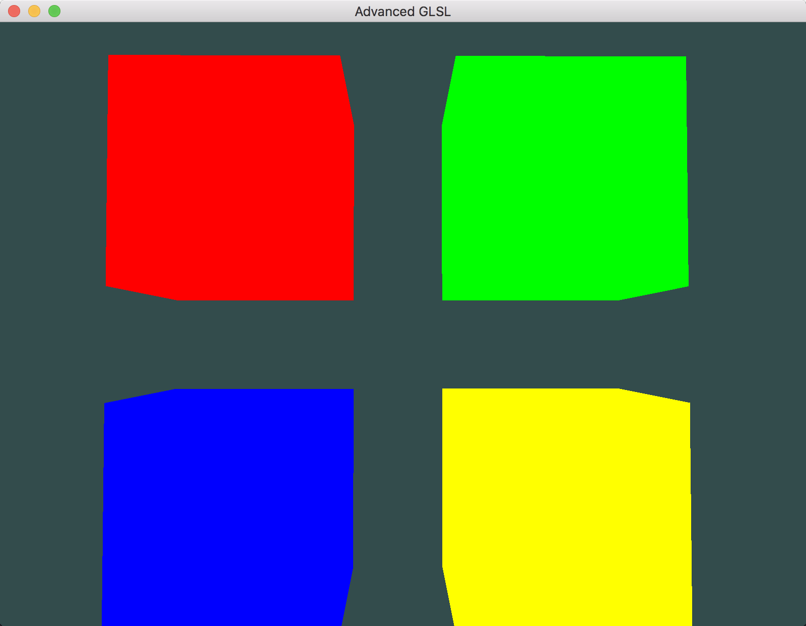

# Advanced GLSL

---

> 使用 `uniform` 块(std140布局)设置观察矩阵和投影矩阵来显示 `4` 个立方体，每个立方体的着色器使用相同的顶点着色器但使用不同的片段着色器输出不同的颜色。

---

# 参考
教程来源：[https://learnopengl.com/](https://learnopengl.com/Advanced-OpenGL/Advanced-GLSL)。