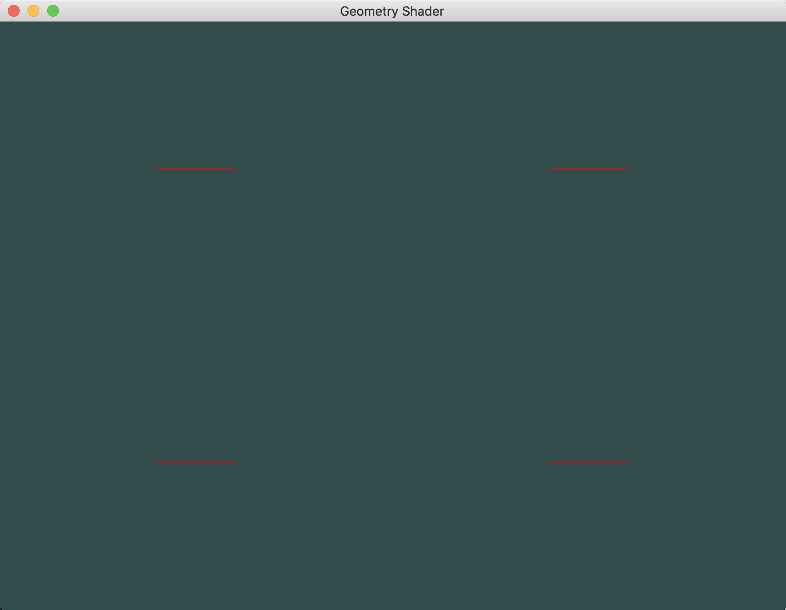
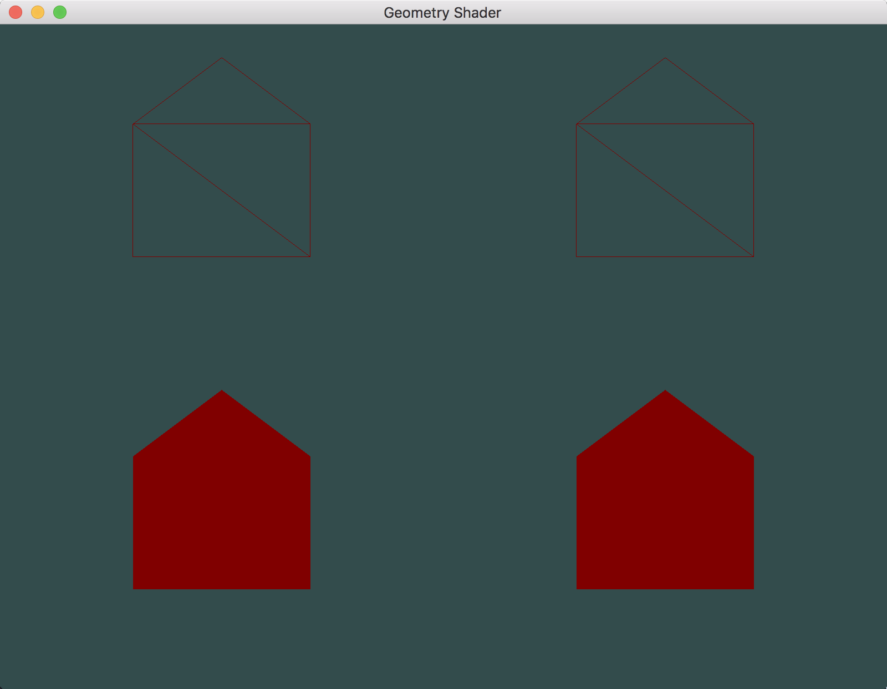
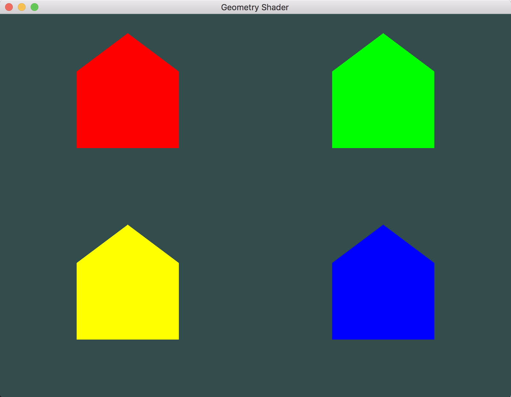
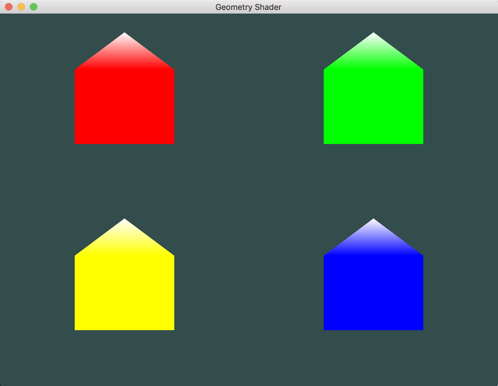

# Geometry Shader

---

1. 使用几何着色器生成新图元(线图元)：

	
2. 使用几何着色器生成新图元(三角形图元)造房子：

	
3. 赋予房子不同的颜色：

	
4.	模拟冬天下雪了（房子屋顶赋予白色）：

	

---

# 参考
教程来源：[https://learnopengl.com/](https://learnopengl.com/Advanced-OpenGL/Geometry-Shader)。