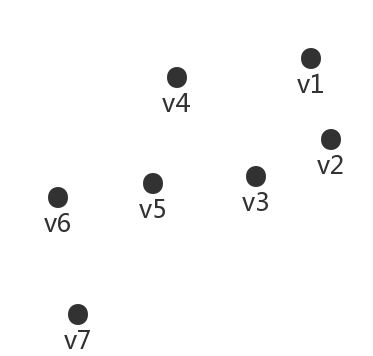
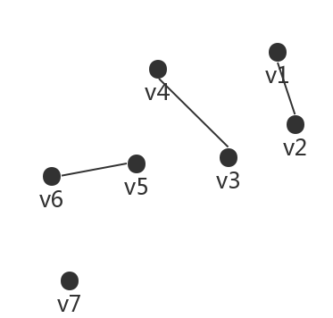
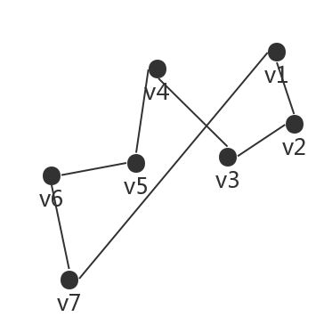
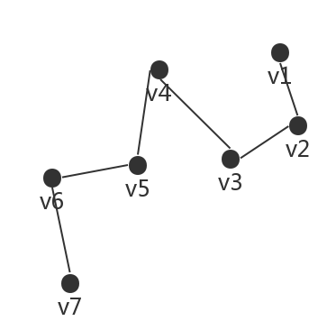
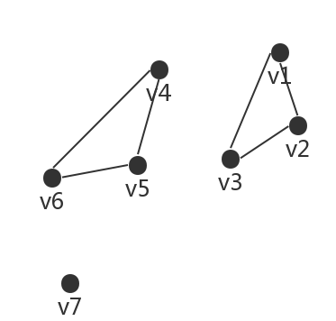
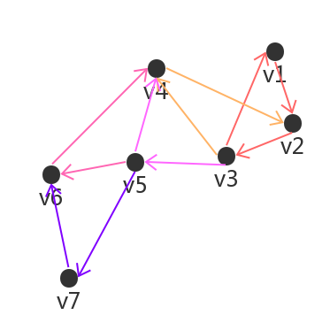
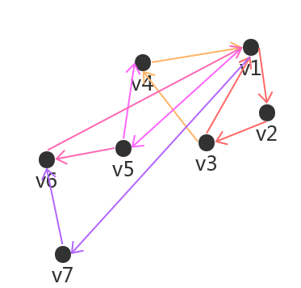

# OpenGL学习笔记（二十九）—— Geometry Shader

---

> `glDrawArrays(GLenum mode, GLint first, GLsizei count);` 和 `glDrawElements(GLenum mode, GLsizei count, GLenum type, const void *indices);` 是用于会渲染绘制图形的。

其参数 **mode** 表示几何图元的描述类型，常见的类型如下：

| 类型 | 说明 | 示意图 | 备注 |
| -------- | -------- | -------- | -------- |
| `GL_POINTS` | 单个顶点集 |  | 为 `n` 个顶点的每一个都绘制一个点 |
| `GL_LINES` | 多组双顶点线段 |  | 两个顶点解释为一条直线，直线之间并不连接(如果奇数个顶点，最后一个将忽略) |
| `GL_LINE_LOOP` | 闭合折线 |  | 从 `v1` 到 `vN` 一系列的直线且构成环 |
| `GL_LINE_STRIP` | 不闭合折线 |  | 从 `v1` 到 `vN` 一系列的直线 |
| `GL_TRAINGLES` | 多组独立填充三角形 |  | 一系列的三角形(`3`的倍数个顶点，多余的将忽略) |
| `GL_TRAINGLE_STRIP` | 线型连续填充三角形串 |  | `(v1,v2,v3)`，`(v2，v3，v4)`，依次类推(所有的三角形是按相同方向绘制) |
| `GL_TRAINGLE_FAN` | 扇形连续填充三角形串 |  | `(v1,v2,v3)`，`(v1,v3,v4)`，以此类推(一直是以`v1`开始) |


## 几何着色器
**几何着色器(Geometry Shader)：**位于顶点和片段着色器之间的一个 （*可选的*） 着色器，其输入是一个图元（如点或三角形）的一组顶点；可以在顶点发送到下一着色器阶段之前对它们随意变换。

一个简单的几何着色器例子：

``` C
#version 330 core       /* 指定 GLSL 版本3.3，匹配 OpenGL 版本 */

layout (points) in;     /* 指定几何着色器输入的图元类型 */

layout (line_strip, max_vertices = 2) out;  /* 指定几何着色器输出的图元类型和最大能够输出的顶点数量 */

/* GLSL 内建变量：'gl_in' 大致结构如下
in gl_Vertex
{
    vec4  gl_Position;
    float gl_PointSize;
    float gl_ClipDistance[];
} gl_in[];
*/

void main()
{
    /* 修改顶点位置向量 */
    gl_Position = gl_in[0].gl_Position + vec4(-0.1, 0.0, 0.0, 0.0);
    /* 几何着色器函数，将 gl_Position 中的(位置)向量添加到图元中，
     即：发射出新顶点 */
    EmitVertex();
    
    /* 修改顶点位置向量 */
    gl_Position = gl_in[0].gl_Position + vec4( 0.1, 0.0, 0.0, 0.0);
    /* 发射新顶点 */
    EmitVertex();
    
    /* 几何着色器函数，将发射出的(Emitted)顶点合成为指定的输出渲染图元 */
    EndPrimitive();
}
```

- 几何着色器**输入**的图元类型：

	| 图元值 | 说明 |
	| :--------: | -------- |
	| `points` | 绘制 `GL_POINTS` 图元时（最小顶点数：1） |
	| `lines` | 绘制 `GL_LINES` 或 `GL_LINE_STRIP`时（最小顶点数：2） |
	| `lines_adjacency` | 绘制 `GL_LINES_ADJACENCY` 或 `GL_LINE_STRIP_ADJACENCY` 时（最小顶点数：4） |
	| `triangles` | 绘制 `GL_TRIANGLES`、`GL_TRIANGLE_STRIP` 或 `GL_TRIANGLE_FAN` 时（最小顶点数：3） |
	| `triangles_adjacency` | 绘制 `GL_TRIANGLES_ADJACENCY` 或 `GL_TRIANGLE_STRIP_ADJACENCY` 时（最小顶点数：6） |
- 几何着色器**输出**的图元类型：

	| 图元值 |
	| :--------: |
	| `points`|
	| `line_strip` |
	| `triangle_strip` |
	

## 爆破物体
**爆破(Explode)物体：**是指将每个三角形图元沿着法向量的方向移动一小段距离(效果就是，整个物体看起来像是沿着每个三角形的法线向量爆炸一样)。

几何着色器大致如下：

``` C
#version 330 core       /* 指定 GLSL 版本3.3，匹配 OpenGL 版本 */

layout (triangles) in;      /* 指定几何着色器输入的图元类型 */

layout (triangle_strip, max_vertices = 3) out;  /* 指定几何着色器输出的图元类型和最大能够输出的顶点数量 */

/* 输入接口块
 因为几何着色器是作用于输入的一组顶点的，
 从顶点着色器发来输入数据总是会以数组的形式表示出来。 */
in VS_OUT {
    vec2 texCoords;     // 输入，纹理坐标
} gs_in[];

out vec2 TexCoords;     // 输出，纹理坐标

uniform float timeValue;     // 时间

/**
 计算(三角形图元)单位法向量
 
 return 单位法向量
 */
vec3 GetNormal()
{
    // 计算平行于三角形图元平面的向量：a
    vec3 a = vec3(gl_in[0].gl_Position) - vec3(gl_in[1].gl_Position);
    // 计算平行于三角形图元平面的向量：b
    vec3 b = vec3(gl_in[2].gl_Position) - vec3(gl_in[1].gl_Position);
    // 通过叉乘计算三角形图元的法向量
    return normalize(cross(a, b));
}

/**
 计算(三角形图元)爆破后的位置向量
 
 @param position 顶点位置向量
 @param normal 顶点法向量
 @return 顶点爆破后的位置向量
 */
vec4 explode(vec4 position, vec3 normal)
{
    float magnitude = 0.5;  // 爆破级别
    // 爆破距离
    vec3 direction = normal * ((sin(timeValue) + 1.0) / 2.0) * magnitude;
    // 沿着法向量位移(爆破)距离
    return position + vec4(direction, 0.0);
}

void main()
{
    vec3 normal = GetNormal();
    
    gl_Position = explode(gl_in[0].gl_Position, normal);    // 计算三角形图元顶点 1 爆破位置
    TexCoords = gs_in[0].texCoords;
    EmitVertex();   /* 发射顶点 */
    gl_Position = explode(gl_in[1].gl_Position, normal);    // 计算三角形图元顶点 2 爆破位置
    TexCoords = gs_in[1].texCoords;
    EmitVertex();   /* 发射顶点 */
    gl_Position = explode(gl_in[2].gl_Position, normal);    // 计算三角形图元顶点 3 爆破位置
    TexCoords = gs_in[2].texCoords;
    EmitVertex();   /* 发射顶点 */
    EndPrimitive(); /* 将发射出的(Emitted)顶点合成为指定的输出渲染图元 */
}
```


## 法向量可视化
> 在写光照着色器的时候，有可能会得到一些奇怪的视觉输出，其原因有可能是法向量错误导致的；法向量错误可能是由于不正确加载顶点数据、错误地将其定义为顶点属性或在着色器中不正确地管理所导致的。

然而有一种很好用的方式可以检测法向量是否正确，那就是 **法向量可视化**；其实现思路如下：

- 首先不使用几何着色器正常绘制场景；
- 然后只显示通过几何着色器生成的法向量来绘制场景；

几何着色器大致如下：

``` C
#version 330 core       /* 指定GLSL版本3.3，匹配 OpenGL 版本 */

layout (triangles) in;  /* 指定几何着色器输入的图元类型 */

layout (line_strip, max_vertices = 6) out;  /* 指定几何着色器输出的图元类型和最大能够输出的顶点数量 */

/* 输入接口块
 因为几何着色器是作用于输入的一组顶点的，
 从顶点着色器发来输入数据总是会以数组的形式表示出来。 */
in VS_OUT {
    vec3 normal;
} gs_in[];

const float magnitude  = 0.1;    // 等级

/**
 生成法线
 
 @param index 顶点下标
 */
void GenerateNormal(int index)
{
    gl_Position = gl_in[index].gl_Position;
    EmitVertex();   /* 发射顶点 */
    /* 将顶点位置沿着法向量平移一段距离 */
    gl_Position = gl_in[index].gl_Position + vec4(gs_in[index].normal, 0.0) * magnitude ;
    EmitVertex();   /* 发射顶点 */
    EndPrimitive(); /* 将发射出的(Emitted)顶点合成为指定的输出渲染图元：line_strip */
}

void main()
{
    /* 三角形图元有三个顶点 */
    for (int index = 0; index < 3; index++)
    {
       GenerateNormal(index);
    }
}
```
	

---


# 参考
教程来源：[https://learnopengl.com/](https://learnopengl.com/Advanced-OpenGL/Geometry-Shader)。